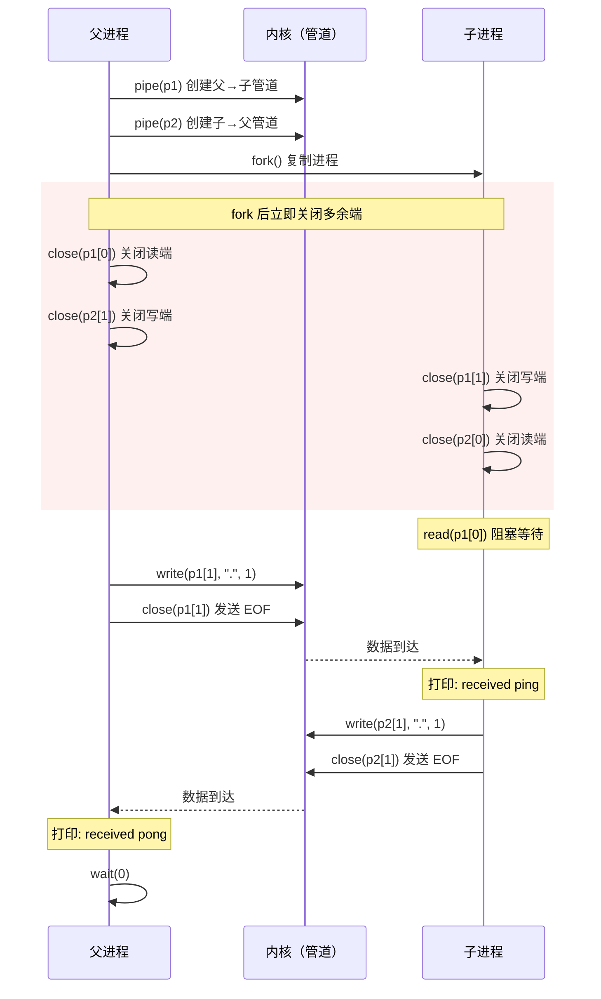
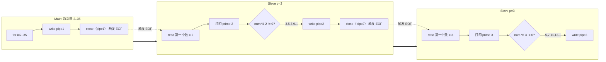
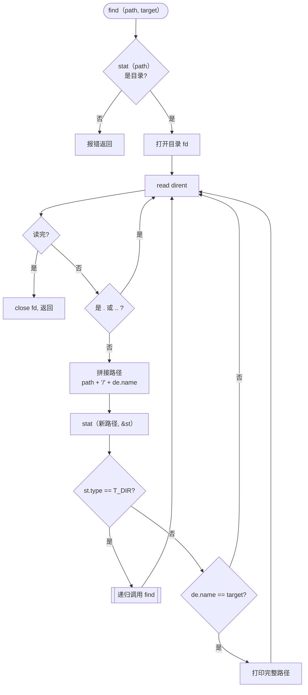
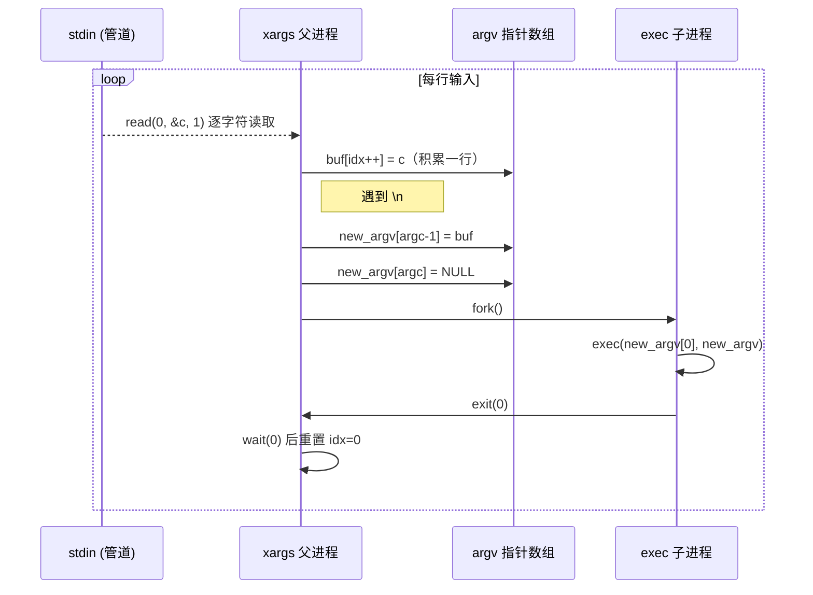

# Lab 1: Xv6 and Unix Utilities

## 任务描述

### 1. Boot xv6 (Easy)
切换到 `util` 分支，编译运行 xv6。熟悉 `make qemu` 启动与 `Ctrl-a x` 退出。

### 2. sleep (Easy)
实现 `user/sleep.c`：接收命令行参数 ticks，调用 `sleep` 系统调用。

### 3. pingpong (Easy)
实现 `user/pingpong.c`：父子进程通过两个管道互相传递一个字节。

### 4. primes (Moderate/Hard)
实现 `user/primes.c`：用管道递归实现并发质数筛（埃拉托斯特尼筛法）。

### 5. find (Moderate)
实现 `user/find.c`：递归搜索目录树，查找匹配文件名的文件。

### 6. xargs (Moderate)
实现 `user/xargs.c`：从标准输入读取行，为每行执行一次指定命令。

---

## 核心实现

### sleep.c

```c
#include "kernel/types.h"
#include "user/user.h"

int main(int argc, char *argv[]) {
    if (argc < 2) {
        fprintf(2, "Usage: sleep <ticks>\n");
        exit(1);
    }
    sleep(atoi(argv[1]));
    exit(0);
}
```

### pingpong.c

```c
#include "kernel/types.h"
#include "user/user.h"

int main(int argc, char *argv[]) {
    int p1[2], p2[2];
    pipe(p1); pipe(p2);

    int pid = fork();
    if (pid < 0) { exit(1); }

    if (pid == 0) {
        // 子进程
        close(p1[1]); close(p2[0]);
        char buf;
        read(p1[0], &buf, 1);
        printf("%d: received ping\n", getpid());
        write(p2[1], &buf, 1);
        close(p1[0]); close(p2[1]);
        exit(0);
    } else {
        // 父进程
        close(p1[0]); close(p2[1]);
        write(p1[1], ".", 1);
        close(p1[1]);
        char buf;
        read(p2[0], &buf, 1);
        printf("%d: received pong\n", getpid());
        close(p2[0]);
        wait(0);
        exit(0);
    }
}
```

### primes.c

```c
#include "kernel/types.h"
#include "user/user.h"

void sieve(int left_fd) {
    int p;
    if (read(left_fd, &p, sizeof(int)) == 0) {
        close(left_fd); exit(0);
    }
    printf("prime %d\n", p);

    int right_fd[2];
    pipe(right_fd);

    if (fork() == 0) {
        close(right_fd[1]);
        sieve(right_fd[0]);
    } else {
        close(right_fd[0]);
        int num;
        while (read(left_fd, &num, sizeof(int)) != 0) {
            if (num % p != 0) write(right_fd[1], &num, sizeof(int));
        }
        close(left_fd); close(right_fd[1]);
        wait(0); exit(0);
    }
}

int main(int argc, char *argv[]) {
    int p[2];
    pipe(p);
    if (fork() == 0) {
        close(p[1]); sieve(p[0]);
    } else {
        close(p[0]);
        for (int i = 2; i <= 35; i++) write(p[1], &i, sizeof(int));
        close(p[1]); wait(0);
    }
    exit(0);
}
```

### find.c

```c
#include "kernel/types.h"
#include "kernel/stat.h"
#include "user/user.h"
#include "kernel/fs.h"

void find(char *path, char *target) {
    char buf[512], *p;
    int fd; struct dirent de; struct stat st;

    if ((fd = open(path, 0)) < 0) return;
    if (fstat(fd, &st) < 0) { close(fd); return; }
    if (st.type != T_DIR) { close(fd); return; }

    strcpy(buf, path);
    p = buf + strlen(buf);
    *p++ = '/';

    while (read(fd, &de, sizeof(de)) == sizeof(de)) {
        if (de.inum == 0) continue;
        if (strcmp(de.name, ".") == 0 || strcmp(de.name, "..") == 0) continue;
        memmove(p, de.name, DIRSIZ);
        p[DIRSIZ] = 0;
        if (stat(buf, &st) < 0) continue;
        if (st.type == T_DIR) find(buf, target);
        else if (st.type == T_FILE && strcmp(de.name, target) == 0)
            printf("%s\n", buf);
    }
    close(fd);
}

int main(int argc, char *argv[]) {
    if (argc < 3) exit(1);
    find(argv[1], argv[2]);
    exit(0);
}
```

### xargs.c

```c
#include "kernel/types.h"
#include "user/user.h"
#include "kernel/param.h"

int main(int argc, char *argv[]) {
    char *new_argv[MAXARG];
    for (int i = 1; i < argc; i++) new_argv[i-1] = argv[i];

    char buf[512], c;
    int idx = 0;
    while (read(0, &c, 1) > 0) {
        if (c == '\n') {
            buf[idx] = 0;
            new_argv[argc-1] = buf;
            new_argv[argc] = 0;
            if (fork() == 0) {
                exec(new_argv[0], new_argv);
                exit(1);
            }
            wait(0); idx = 0;
        } else {
            buf[idx++] = c;
        }
    }
    exit(0);
}
```

---

## 架构与流程图

### pingpong — 文件描述符生命周期



### primes — 递归进程流水线拓扑



### find — 目录递归搜索流程



### xargs — 动态参数装配与执行流



---

## 关键设计点

### 1. 文件描述符管理（pingpong / primes）
`fork()` 后必须立即关闭不需要的管道端。管道的 EOF 信号依赖写端全部关闭，不关闭会导致 `read()` 永久阻塞。

### 2. 递归进程流水线（primes）
每个进程第一个读取的数字必为质数，用作过滤器条件 `num % p != 0`。递归生成进程树，`wait(0)` 保证级联退出。

### 3. 目录遍历与递归（find）
`dirent` 含文件名，`stat` 判断类型。`memmove` 配合 `p[DIRSIZ] = 0` 安全拼接路径。跳过 `.` 和 `..` 防止死循环。

### 4. exec 参数数组（xargs）
`exec` 依赖 NULL 结尾的指针数组，忘记置零会导致段错误。缓冲区每行处理后必须重置索引。
