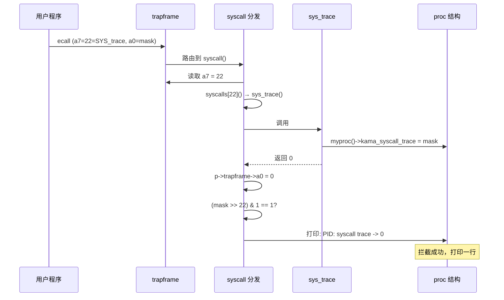
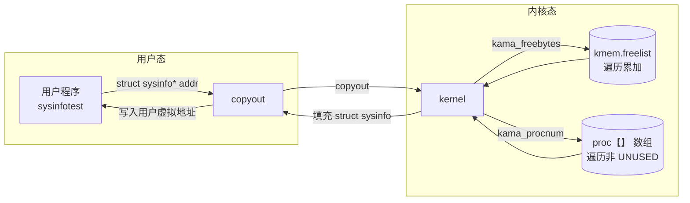
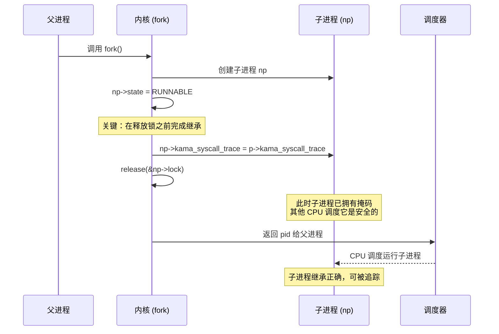

# Lab 2: System Calls

## 任务描述

### 实验一：System Call Tracing (Moderate)
添加 `trace(int mask)` 系统调用，追踪指定系统调用的执行并打印 `PID: syscall name -> return value`。mask 通过 fork 继承。

### 实验二：Sysinfo (Moderate)
添加 `sysinfo(struct sysinfo *)` 系统调用，返回系统当前空闲内存字节数（`freemem`）和活跃进程数（`nproc`）。

---

## 核心实现

### 基础设施（两个实验通用）

```c
// kernel/syscall.h
#define SYS_trace   22
#define SYS_sysinfo 23

// user/user.h
struct sysinfo;
int trace(int);
int sysinfo(struct sysinfo*);

// user/usys.pl
entry("trace");
entry("sysinfo");

// kernel/syscall.c
extern uint64 sys_trace(void);
extern uint64 sys_sysinfo(void);
static uint64 (*syscalls[])(void) = {
    // ...
    [SYS_trace]   sys_trace,
    [SYS_sysinfo] sys_sysinfo,
};
```

### Lab 1: trace — 进程属性与继承

```c
// kernel/proc.h
struct proc {
    // ...
    uint64 kama_syscall_trace; // 存储追踪掩码
};

// kernel/proc.c — allocproc 中初始化
p->kama_syscall_trace = 0;

// kernel/proc.c — fork 中继承（在释放子进程锁之前）
np->kama_syscall_trace = p->kama_syscall_trace;

// kernel/sysproc.c
uint64 sys_trace(void) {
    int mask;
    if (argint(0, &mask) < 0) return -1;
    myproc()->kama_syscall_trace = mask;
    return 0;
}

// kernel/syscall.c — 拦截打印
const char* kama_syscall_names[] = {
    [SYS_fork] "fork", [SYS_read] "read",
    // ...
    [SYS_trace] "trace",
};

void syscall(void) {
    int num = p->trapframe->a7;
    if (num > 0 && num < NELEM(syscalls) && syscalls[num]) {
        p->trapframe->a0 = syscalls[num]();
        if ((p->kama_syscall_trace >> num) & 1) {
            printf("%d: syscall %s -> %d\n",
                p->pid, kama_syscall_names[num], p->trapframe->a0);
        }
    }
}
```

### Lab 2: sysinfo — 内核资源统计与 copyout

```c
// kernel/kalloc.c — 统计空闲内存
void kama_freebytes(uint64 *dst) {
    acquire(&kmem.lock);
    *dst = 0;
    for (struct run *r = kmem.freelist; r; r = r->next) *dst += PGSIZE;
    release(&kmem.lock);
}

// kernel/proc.c — 统计活跃进程
void kama_procnum(uint64 *dst) {
    *dst = 0;
    for (struct proc *p = proc; p < &proc[NPROC]; p++) {
        acquire(&p->lock);
        if (p->state != UNUSED) (*dst)++;
        release(&p->lock);
    }
}

// kernel/sysproc.c
#include "kernel/sysinfo.h"

uint64 sys_sysinfo(void) {
    struct sysinfo info;
    kama_freebytes(&info.freemem);
    kama_procnum(&info.nproc);
    uint64 addr;
    if (argaddr(0, &addr) < 0) return -1;
    if (copyout(myproc()->pagetable, addr,
                (char*)&info, sizeof(info)) < 0) return -1;
    return 0;
}
```

---

## 架构与流程图

### trace — 系统调用拦截与打印流程



### sysinfo — 内核资源统计与跨空间拷贝



### trace — fork 继承时序（并发安全）



---

## 关键设计点

### 1. fork 中的并发安全（trace）
`trace` 掩码必须在 `release(&np->lock)` 之前拷贝，否则子进程被其他 CPU 调度前处于"裸奔"状态，无法被追踪。

### 2. copyout 跨空间传输（sysinfo）
用户传进来的是虚拟地址，内核不能直接解引用。通过 `copyout(pagetable, dst, src, len)` 将内核数据安全写入用户空间。

### 3. 遍历内核数据结构（sysinfo）
空闲内存通过遍历 `kmem.freelist` 链表累加页数；进程数通过遍历 `proc[]` 数组统计非 `UNUSED` 状态。
