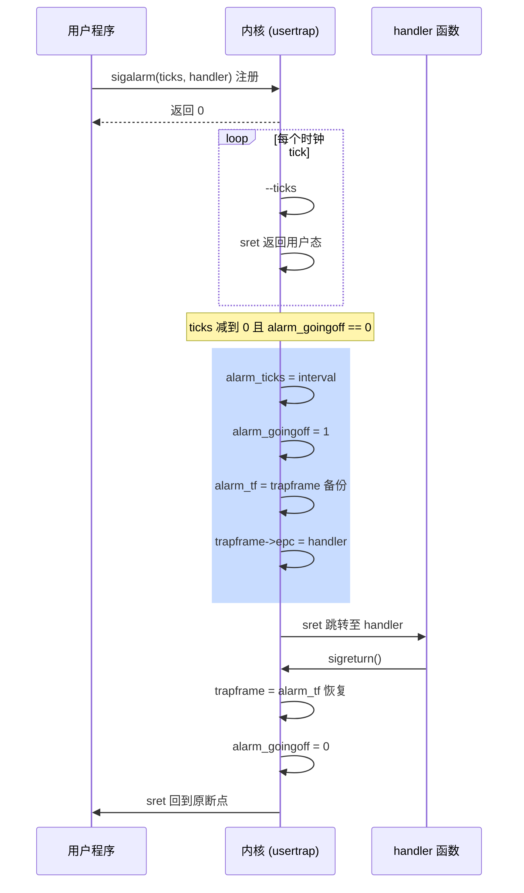
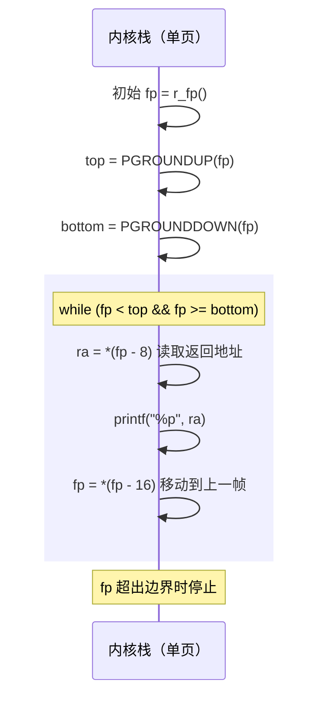
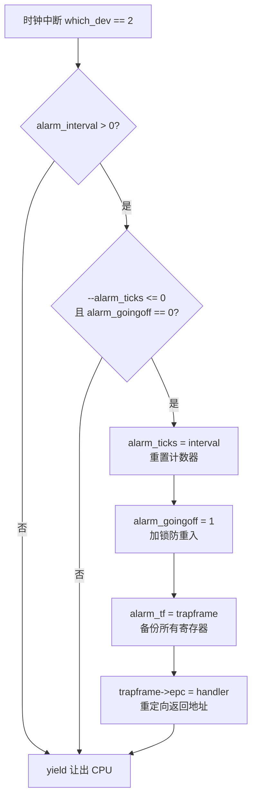

# Lab 3: Traps

## 任务描述

### 任务一：RISC-V 汇编分析 (Easy)
阅读 `user/call.asm`，分析调用约定、参数传递、编译器优化，在 `answers-traps.txt` 中记录答案。

### 任务二：Backtrace (Moderate)
在内核中实现 `backtrace()`，在 `sys_sleep` 和 `panic` 中调用。利用栈帧指针（fp）链回溯返回地址。

### 任务三：Alarm (Hard)
添加 `sigalarm(interval, handler)` 和 `sigreturn()` 系统调用，实现进程定时警报——在指定 ticks 后自动调用用户处理函数。

---

## 核心实现

### 基础设施

```c
// kernel/riscv.h — 添加帧指针读取
static inline uint64 r_fp(void) {
    uint64 x;
    asm volatile("mv %0, s0" : "=r" (x));
    return x;
}

// kernel/defs.h
void backtrace(void);
int kama_sigalarm(int, void(*)());
int kama_sigreturn(void);
```

### Backtrace

```c
// kernel/printf.c
void backtrace(void) {
    uint64 fp = r_fp();
    uint64 top = PGROUNDUP(fp);
    uint64 bottom = PGROUNDDOWN(fp);
    printf("backtrace:\n");
    while (fp < top && fp >= bottom) {
        uint64 ra = *(uint64*)(fp - 8);
        printf("%p\n", ra);
        fp = *(uint64*)(fp - 16);
    }
}

void panic(char *s) {
    printf("panic: "); printf(s); printf("\n");
    backtrace();  // 崩溃时自动回溯
    panicked = 1;
    for (;;);
}
```

### Alarm — 进程数据结构

```c
// kernel/proc.h
struct proc {
    // ...
    int alarm_interval;
    void (*alarm_handler)();
    int alarm_ticks;
    struct trapframe *alarm_tf;  // 备份陷阱帧
    int alarm_goingoff;           // 重入保护
};

// kernel/proc.c — allocproc 中
p->alarm_tf = (struct trapframe*)kalloc();
// ...
p->alarm_interval = 0;
p->alarm_handler = 0;
p->alarm_ticks = 0;
p->alarm_goingoff = 0;

// kernel/proc.c — freeproc 中
if (p->alarm_tf) kfree((void*)p->alarm_tf);
p->alarm_tf = 0;
// ...
p->alarm_interval = 0; p->alarm_handler = 0;
// ...
```

### Alarm — 系统调用入口

```c
// kernel/sysproc.c
uint64 sys_sigalarm(void) {
    int n; uint64 fn;
    if (argint(0, &n) < 0) return -1;
    if (argaddr(1, &fn) < 0) return -1;
    return kama_sigalarm(n, (void(*)())fn);
}

uint64 sys_sigreturn(void) {
    return kama_sigreturn();
}
```

### Alarm — 核心逻辑

```c
// kernel/trap.c

int kama_sigalarm(int ticks, void(*handler)()) {
    struct proc *p = myproc();
    p->alarm_interval = ticks;
    p->alarm_handler = handler;
    p->alarm_ticks = ticks;
    return 0;
}

int kama_sigreturn(void) {
    struct proc *p = myproc();
    *p->trapframe = *p->alarm_tf;  // 恢复寄存器快照
    p->alarm_goingoff = 0;
    return p->trapframe->a0;
}

// kernel/trap.c — usertrap() 中增加
if (which_dev == 2) {  // 时钟中断
    if (p->alarm_interval > 0) {
        if (--p->alarm_ticks <= 0 && p->alarm_goingoff == 0) {
            p->alarm_ticks = p->alarm_interval;
            p->alarm_goingoff = 1;
            *p->alarm_tf = *p->trapframe;      // 备份现场
            p->trapframe->epc = (uint64)p->alarm_handler;  // 重定向
        }
    }
    yield();
}
```

---

## 架构与流程图

### Alarm — 全生命周期时序



### Backtrace — 栈帧指针链回溯



### Alarm — usertrap 触发逻辑



---

## 关键设计点

### 1. 栈帧链（Backtrace）
返回地址位于 `fp - 8`，上一帧指针位于 `fp - 16`。用 `PGROUNDUP/PGROUNDDOWN` 防止越界访问。

### 2. trapframe 快照（Alarm）
`*p->alarm_tf = *p->trapframe` 一次性备份所有寄存器。恢复时整体覆盖，实现"无痕跳转"。

### 3. 重入保护（Alarm）
`alarm_goingoff` 标志位防止 handler 未返回时再次触发。`sigreturn` 返回恢复后的 `a0`，而非简单的 0。

### 4. EPC 重定向（Alarm）
修改 `trapframe->epc` 为 handler 地址，使得从 `usertrapret()` 返回用户态时跳转至 handler 而非原程序断点。
