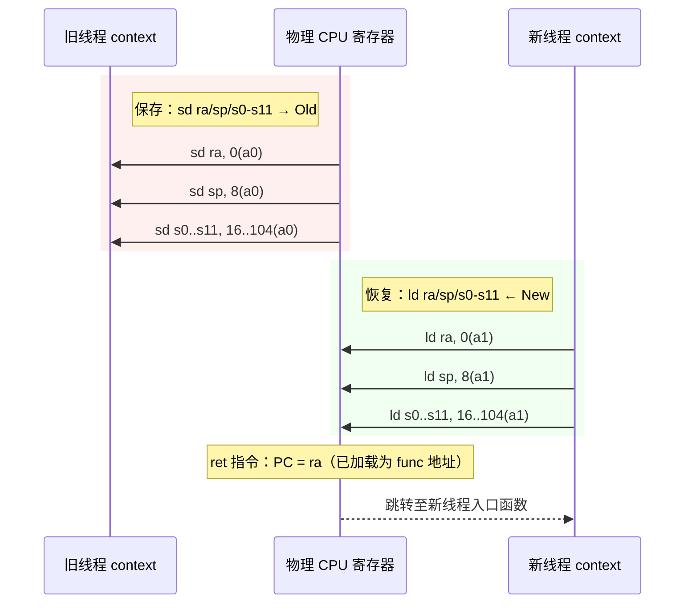
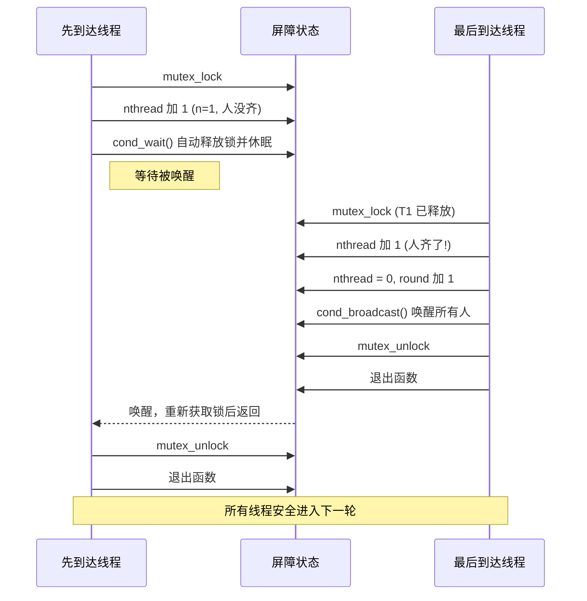

# Lab 4: Multithreading

## 任务描述

### 任务一：Uthread (Moderate)
在 xv6 用户态实现线程切换。补全 `thread_create()` 和 `thread_schedule()`，编写汇编 `thread_switch.S`。

### 任务二：Using threads (Moderate)
修复 Linux 哈希表 `notxv6/ph.c` 的并发 bug，实现 `ph_safe`（正确性）和 `ph_fast`（分段锁性能）。

### 任务三：Barrier (Moderate)
实现 `notxv6/barrier.c` 中的 `barrier()` 函数，使用条件变量实现线程同步点。

---

## 核心实现

### Uthread — 上下文结构

```c
// user/uthread.c
struct context {
    uint64 ra; uint64 sp;
    uint64 s0; uint64 s1; uint64 s2; uint64 s3; uint64 s4;
    uint64 s5; uint64 s6; uint64 s7; uint64 s8; uint64 s9;
    uint64 s10; uint64 s11;
};

struct thread {
    char stack[8192];
    int state;
    struct context context;
};

// thread_create：初始化上下文
void thread_create(void (*func)()) {
    struct thread *t;
    for (t = all_thread; t < all_thread + MAX_THREAD; t++)
        if (t->state == FREE) break;
    t->state = RUNNABLE;
    t->context.ra = (uint64)func;
    t->context.sp = (uint64)t->stack + STACK_SIZE;
}

// thread_schedule：轮询切换
void thread_schedule(void) {
    struct thread *t = 0, *next_thread = current_thread + 1;
    for (int i = 0; i < MAX_THREAD; i++) {
        if (++next_thread >= all_thread + MAX_THREAD)
            next_thread = all_thread;
        if (next_thread->state == RUNNABLE) { t = next_thread; break; }
    }
    if (t) {
        t->state = RUNNING;
        struct thread *old = current_thread;
        current_thread = t;
        thread_switch(&old->context, &t->context);
    }
}
```

### Uthread — 汇编切换

```assembly
# user/uthread_switch.S
    .globl thread_switch
thread_switch:
    sd ra, 0(a0)
    sd sp, 8(a0)
    sd s0, 16(a0); sd s1, 24(a0); sd s2, 32(a0); sd s3, 40(a0)
    sd s4, 48(a0); sd s5, 56(a0); sd s6, 64(a0); sd s7, 72(a0)
    sd s8, 80(a0); sd s9, 88(a0); sd s10, 96(a0); sd s11, 104(a0)
    ld ra, 0(a1); ld sp, 8(a1)
    ld s0, 16(a1); ld s1, 24(a1); ld s2, 32(a1); ld s3, 40(a1)
    ld s4, 48(a1); ld s5, 56(a1); ld s6, 64(a1); ld s7, 72(a1)
    ld s8, 80(a1); ld s9, 88(a1); ld s10, 96(a1); ld s11, 104(a1)
    ret
```

### Using threads — 分段锁

```c
// notxv6/ph.c
#define NBUCKET 5
pthread_mutex_t locks[NBUCKET];

static void put(int key, int value) {
    int i = key % NBUCKET;
    pthread_mutex_lock(&locks[i]);
    struct entry *e;
    for (e = table[i]; e; e = e->next)
        if (e->key == key) break;
    if (e) e->value = value;
    else insert(key, value, &table[i], table[i]);
    pthread_mutex_unlock(&locks[i]);
}

// main 中初始化
for (int i = 0; i < NBUCKET; i++) pthread_mutex_init(&locks[i], NULL);
```

### Barrier — 条件变量同步

```c
// notxv6/barrier.c
struct barrier {
    pthread_mutex_t barrier_mutex;
    pthread_cond_t barrier_cond;
    int nthread;
    int round;
} bstate;

static void barrier(void) {
    pthread_mutex_lock(&bstate.barrier_mutex);
    bstate.nthread++;
    if (bstate.nthread < nthread) {
        pthread_cond_wait(&bstate.barrier_cond, &bstate.barrier_mutex);
    } else {
        bstate.nthread = 0;
        bstate.round++;
        pthread_cond_broadcast(&bstate.barrier_cond);
    }
    pthread_mutex_unlock(&bstate.barrier_mutex);
}
```

---

## 架构与流程图

### Uthread — 上下文切换寄存器搬运



### Using threads — 哈希桶锁并发模型

```mermaid
flowchart TD
    subgraph T1[线程 A: put（7）]
        I1["i = 7 % 5 = 2"] --> L2["acquire(locks[2])"]
        L2 --> H1["table[2] 遍历查找"]
        H1 --> INS1[insert 写入]
        INS1 --> RL1["release(locks[2])"]
    end

    subgraph T2[线程 B: put（12）]
        I2["i = 12 % 5 = 2"] --> L2B["acquire(locks[2])"]
        L2B --> H2["table[2] 遍历查找"]
        H2 --> INS2[insert 写入]
        INS2 --> RL2["release(locks[2])"]
    end

    subgraph T3[线程 C: put（3）]
        I3["i = 3 % 5 = 3"] --> L3["acquire(locks[3])"]
        L3 --> INS3[insert 写入]
        INS3 --> RL3["release(locks[3])"]
    end

    %% 修复部分：使用连接线或独立节点替代 Note
    Note1["⚠️ 桶 2 冲突：<br/>T1 与 T2 互斥排队（竞争锁 2）"]
    Note2["✅ 并行执行：<br/>T3 访问不同桶，无需等待"]

    %% 将注释关联到对应的子图
    Note1 -.-> T1
    Note1 -.-> T2
    Note2 -.-> T3

    %% 样式设置
    style T1 fill:#fff3e0
    style T2 fill:#fff3e0
    style T3 fill:#e8f5e9
    
    %% 注释节点的样式
    style Note1 fill:#fff,stroke:#ff9800,stroke-dasharray: 5 5
    style Note2 fill:#fff,stroke:#4caf50,stroke-dasharray: 5 5
```



### Barrier — 条件变量同步机制



---

## 关键设计点

### 1. Callee-saved 寄存器（Uthread）
RISC-V 调用约定要求 `ra`, `sp`, `s0-s11` 由被调用者保存。`thread_switch` 保存/恢复这些寄存器即完成上下文切换。

### 2. 栈对齐（Uthread）
`thread_switch` 恢复新线程 `sp` 后，`ret` 指令跳转到 `func`。栈顶须 16 字节对齐以满足 ABI。

### 3. 分段锁 vs 全局锁（Using threads）
全局锁导致所有线程排队等待，吞吐量受限。按哈希桶加锁，不同桶可并行处理，实现 1.25x+ 加速。

### 4. 条件变量的原子性（Barrier）
`pthread_cond_wait` 在等待期间自动释放锁，恢复时重新获取。`broadcast` 确保所有线程同时开始下一轮。
