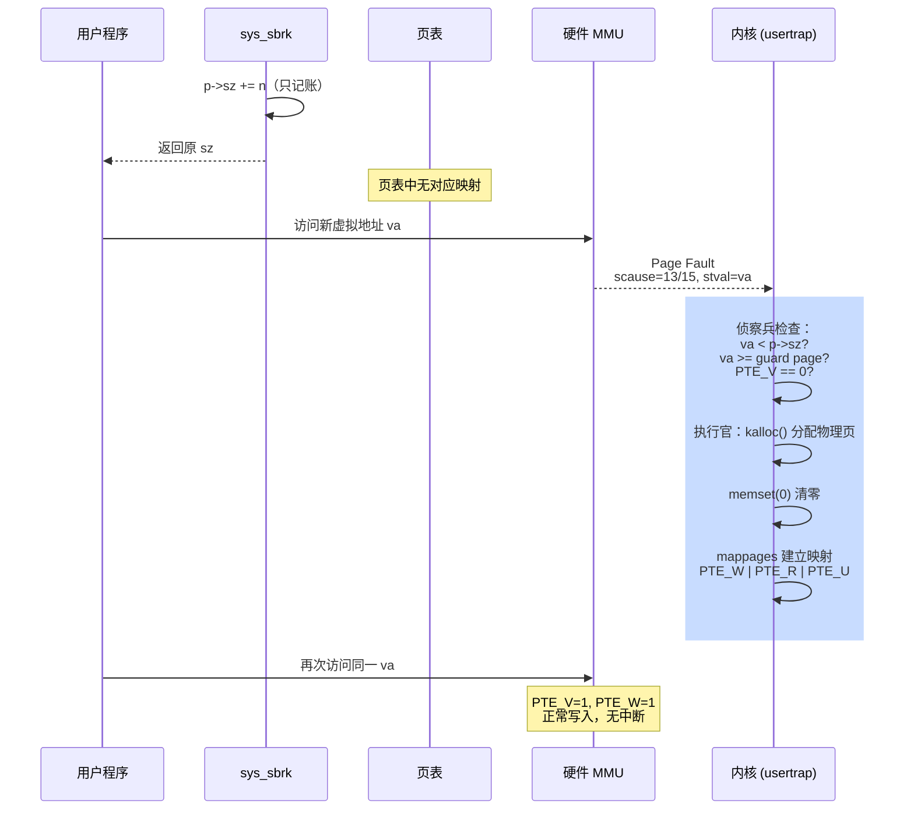
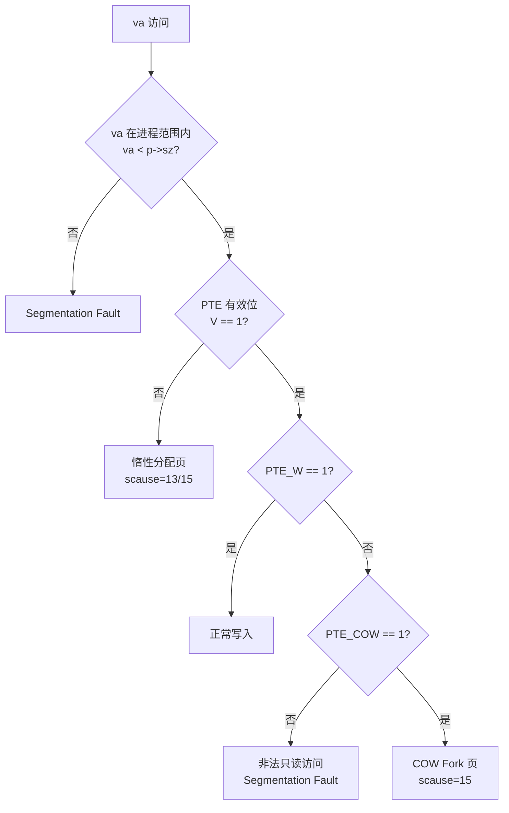

# Lab 5: Lazy Allocation

## 任务描述

### 任务一：取消 sbrk() 立即分配 (Easy)
修改 `sys_sbrk()` 使其只增加 `p->sz` 而不调用 `growproc()`，制造"内存谎言"。

### 任务二：实现惰性分配 (Moderate)
修改 `usertrap()` 捕获 Page Fault (scause 13/15)，在 `trap.c` 中动态分配物理页并建立映射。

### 任务三：鲁棒性与边界处理 (Moderate)
修复 `fork`/`uvmunmap`/`walkaddr` 中的空洞容忍，确保 `lazytests` 和 `usertests` 通过。

---

## 核心实现

### sys_sbrk — 空头支票

```c
// kernel/sysproc.c
uint64 sys_sbrk(void) {
    int n;
    struct proc *p = myproc();
    uint64 addr = p->sz;

    if(argint(0, &n) < 0) return -1;

    if(n > 0) {
        p->sz += n;  // 只改账本，不分配
    } else if(n < 0) {
        p->sz = uvmdealloc(p->pagetable, p->sz, p->sz + n);  // 收缩必须诚实
    }
    return addr;
}
```

### trap.c — 缺页异常处理

```c
// kernel/trap.c — usertrap()
} else if(r_scause() == 13 || r_scause() == 15) {
    uint64 va = r_stval();
    if(kama_uvmshouldallocate(va)) {
        kama_uvmlazyallocate(va);
    } else {
        p->killed = 1;  // 越界访问判处死刑
    }
}
```

### 侦察兵与执行官

```c
// kernel/vm.c

int kama_uvmshouldallocate(uint64 va) {
    struct proc *p = myproc();
    if(va >= p->sz) return 0;                    // 越界
    if(va < PGROUNDDOWN(p->trapframe->sp)) return 0;  // 触碰 Guard Page
    pte_t *pte = walk(p->pagetable, va, 0);
    if(pte == 0 || (*pte & PTE_V) == 0) return 1;  // 页表空洞，需要分配
    return 0;
}

void kama_uvmlazyallocate(uint64 va) {
    struct proc *p = myproc();
    char *pa = kalloc();
    if(pa == 0) { p->killed = 1; return; }
    memset(pa, 0, PGSIZE);
    if(mappages(p->pagetable, PGROUNDDOWN(va), PGSIZE,
                (uint64)pa, PTE_W|PTE_R|PTE_U) != 0) {
        kfree(pa); p->killed = 1;
    }
}
```

### uvmunmap / uvmcopy — 宽容空洞

```c
// kernel/vm.c
void uvmunmap(pagetable_t pt, uint64 va, uint64 npages, int do_free) {
    for(a = va; a < va + npages*PGSIZE; a += PGSIZE) {
        if((pte = walk(pt, a, 0)) == 0) continue;      // 中间页表不存在
        if((*pte & PTE_V) == 0) continue;               // Lazy 空洞页
        // ... 释放逻辑
    }
}

int uvmcopy(pagetable_t old, pagetable_t new, uint64 sz) {
    for(i = 0; i < sz; i += PGSIZE) {
        if((pte = walk(old, i, 0)) == 0) continue;      // 父页表项不存在
        if((*pte & PTE_V) == 0) continue;               // 父尚未分配物理页
        // ... 拷贝逻辑
    }
    return 0;
}
```

### walkaddr — 支持系统调用

```c
// kernel/vm.c
uint64 walkaddr(pagetable_t pt, uint64 va) {
    pte = walk(pt, va, 0);
    if(pte == 0 || (*pte & PTE_V) == 0) {
        if(kama_uvmshouldallocate(va)) {
            kama_uvmlazyallocate(va);
            pte = walk(pt, va, 0);
            if(pte == 0 || (*pte & PTE_V) == 0) return 0;
        } else { return 0; }
    }
    // ...
}
```

---

## 架构与流程图

### 惰性分配 — 承诺-延迟-补救全流程



### Page Fault 分类判断流程



---

## 关键设计点

### 1. 谎言的代价（trap.c）
`p->sz` 增大但页表无映射 → 用户访问触发 Page Fault → 内核"现场补救"。整个过程对用户透明。

### 2. 双重检查（walkaddr）
内核态系统调用无法触发硬件中断，`walkaddr` 必须主动探测空洞并填补，否则 `read`/`write` 访问 Lazy 地址会返回 0。

### 3. Guard Page 保护
`va < PGROUNDDOWN(p->trapframe->sp)` 防止内核误修补栈底保护页，栈溢出应触发段错误而非静默分配。

### 4. 收缩必须诚实（sbrk n < 0）
释放内存不能撒谎，否则 `uvmdealloc` 会尝试 unmapping 不存在的页——必须在 `sbrk` 层面就真正回收。
