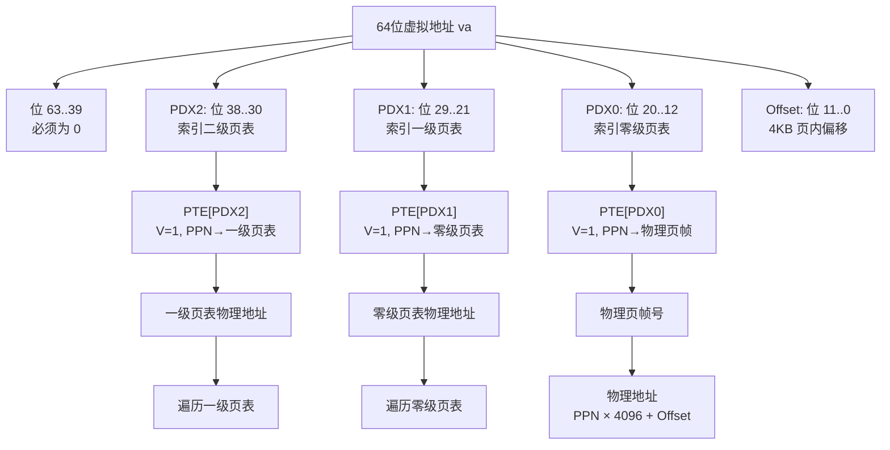
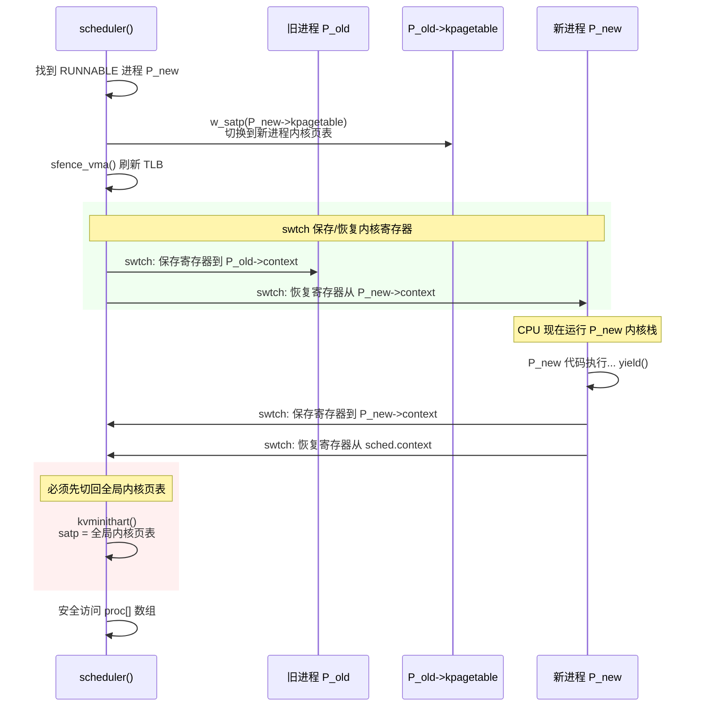

# Lab 6: Page Tables

## 任务描述

### 任务一：vmprint (Easy)
实现 `vmprint()` 递归打印 xv6 三级页表内容，在 `exec.c` 中对 PID=1 进程调用。

### 任务二：Per-process Kernel Page Table (Hard)
为每个进程分配独立内核页表副本，内核态执行时切换 `satp` 寄存器。

### 任务三：Simplify copyin/copyinstr (Hard)
将用户页表映射同步到进程私有内核页表，用 `copyin_new` 替代软件查表。

---

## 核心实现

### vmprint — 递归遍历三级页表

```c
// kernel/vm.c
int vmprint(pagetable_t pt, int level) {
    for(int i = 0; i < 512; i++) {
        pte_t pte = pt[i];
        if((pte & PTE_V) == 0) continue;
        uint64 pa = PTE2PA(pte);
        uint flags = PTE_FLAGS(pte);
        printf(".. ");
        for(int j = 0; j < level; j++) printf(".. ");
        printf("%d: pte=%p pa=%p\n", i, pte, pa);
        if(level < 2 && (pte & (PTE_R|PTE_W|PTE_X)) == 0) {
            vmprint((pagetable_t)pa, level + 1);
        }
    }
    return 0;
}

// kernel/exec.c — userinit 中
if(p->pid == 1) vmprint(p->pagetable);
```

### Per-process Kernel Page Table — 数据结构

```c
// kernel/proc.h
struct proc {
    // ...
    pagetable_t kpagetable;  // 私有内核页表
};
```

### proc_kpagetable — 创建内核页表副本

```c
// kernel/vm.c
pagetable_t proc_kpagetable(struct proc *p) {
    pagetable_t kpt = (pagetable_t) kalloc();
    memset(kpt, 0, PGSIZE);

    kvmmap(kpt, UART0, UART0, PGSIZE, PTE_R|PTE_W);
    kvmmap(kpt, VIRTIO0, VIRTIO0, PGSIZE, PTE_R|PTE_W);
    kvmmap(kpt, PLIC, PLIC, 0x400000, PTE_R|PTE_W);
    kvmmap(kpt, KERNBASE, KERNBASE, (uint64)etext-KERNBASE, PTE_R|PTE_X);
    kvmmap(kpt, (uint64)etext, (uint64)etext, PHYSTOP-(uint64)etext, PTE_R|PTE_W);
    kvmmap(kpt, TRAMPOLINE, (uint64)trampoline, PGSIZE, PTE_R|PTE_X);
    // 注意：内核页表不映射 CLINT，避免多进程冲突

    return kpt;
}
```

### 调度器切换 — satp 与 TLB

```c
// kernel/proc.c — scheduler()
if(p->state == RUNNABLE) {
    p->state = RUNNING;
    c->proc = p;

    w_satp(MAKE_SATP(p->kpagetable));  // 切换到进程私有内核页表
    sfence_vma();

    swtch(&c->context, &p->context);

    kvminithart();  // 切回全局内核页表，保证调度器安全
    c->proc = 0;
}
```

### allocproc / freeproc — 生命周期管理

```c
// allocproc 中
p->kpagetable = proc_kpagetable(p);
char *pa = kalloc();
uint64 va = KSTACK(0);
kvmmap(p->kpagetable, va, (uint64)pa, PGSIZE, PTE_R|PTE_W);
p->kstack = va;

// freeproc 中
if(p->kstack) {
    uint64 pa = kvmpa(p->kpagetable, p->kstack);
    kfree((void*)pa);
}
if(p->kpagetable) proc_free_kpagetable(p->kpagetable);
```

### copyin_new — 用户页表同步

```c
// kernel/vm.c
int uvmcopy_to_kstack(pagetable_t upt, pagetable_t kpt, uint64 start, uint64 sz) {
    if(PGROUNDUP(start + sz) > PLIC) return -1;  // 触顶 PLIC 禁区
    for(uint64 i = PGROUNDUP(start); i < start + sz; i += PGSIZE) {
        pte_t *pte = walk(upt, i, 0);
        uint64 pa = PTE2PA(*pte);
        uint flags = (PTE_FLAGS(*pte) & ~PTE_U);  // 清除 PTE_U，内核才能访问
        if(mappages(kpt, i, PGSIZE, pa, flags) != 0) return -1;
    }
    return 0;
}

// copyin / copyinstr 替换为 copyin_new / copyinstr_new
int copyin(pagetable_t pt, char *dst, uint64 srcva, uint64 len) {
    return copyin_new(pt, dst, srcva, len);
}
```

### 同步触发点 — fork / growproc / exec / userinit

```c
// fork: 复制用户映射到子进程私有内核页表
uvmcopy(p->pagetable, np->pagetable, p->sz);
uvmcopy_to_kstack(np->pagetable, np->kpagetable, 0, p->sz);

// growproc: 内存增长/收缩时同步内核页表映射
uvmcopy_to_kstack(p->pagetable, p->kpagetable, p->sz, n);
kvmdealloc(p->kpagetable, p->sz, sz);

// exec: 替换进程映像时先清旧映射，再同步新映射
kvmdealloc(p->kpagetable, p->sz, 0);
uvmcopy_to_kstack(pagetable, p->kpagetable, 0, sz);
```

---

## 架构与流程图

### Sv39 虚拟地址拆分



### Per-process Kernel Page Table — 调度器切换流程



---

## 关键设计点

### 1. 三级页表结构（vmprint）
RISC-V Sv39 使用 9+9+9 位索引 + 12 位偏移。`level=0` 是 PDX0，`level=1` 是 PDX1，`level=2` 是 PDX2（叶子节点）。

### 2. 私有内核栈（allocproc）
每个进程可以在相同虚拟地址 `KSTACK(0)` 拥有独立内核栈，因为页表是私有的，不存在冲突。

### 3. 清除 PTE_U（copyin_new）
内核页表复制用户映射时必须 `& ~PTE_U`，否则 RISC-V 硬件会在内核态阻止访问这些页，导致 copyin_new 失败。

### 4. PLIC 地址护城河（uvmcopy_to_kstack）
用户进程最大虚拟地址必须 `< PLIC`（0x0C000000），否则用户映射会与硬件外设物理地址空间冲突。

### 5. 调度器安全（scheduler）
`swtch` 返回后必须先切回全局内核页表，再访问内核数据结构（如 `proc[]` 数组），防止用进程的 `kpagetable` 查不到调度器代码。
