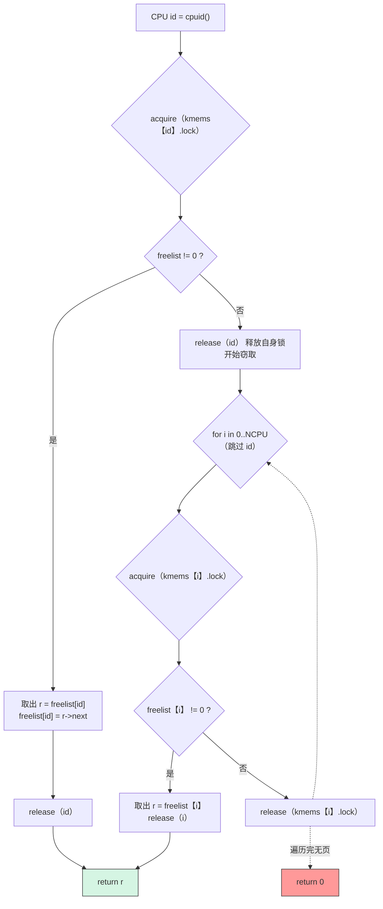
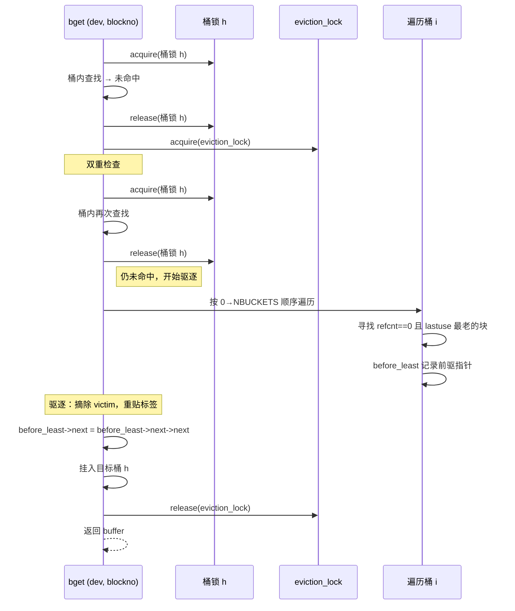

# Lab 7: Locks

## 任务描述

### 任务一：Per-CPU Memory Allocator (Moderate)
将 `kmem` 全局锁拆分为 `kmems[NCPU]` 每 CPU 空闲链表，实现"窃取"机制消除锁竞争。

### 任务二：Buffer Cache (Hard)
将 `bcache` 全局锁替换为 NBUCKET 个哈希桶锁，用时间戳实现 LRU 驱逐。

---

## 核心实现

### kalloc — Per-CPU Freelist + Stealing

```c
// kernel/kalloc.c
struct {
    struct spinlock lock;
    struct run *freelist;
} kmems[NCPU];

void kinit(void) {
    char name[16];
    for(int i = 0; i < NCPU; i++) {
        snprintf(name, sizeof(name), "kmem_%d", i);
        initlock(&kmems[i].lock, name);
    }
    freerange(end, (void*)PHYSTOP);
}

void *kalloc(void) {
    push_off();
    int id = cpuid();

    acquire(&kmems[id].lock);
    struct run *r = kmems[id].freelist;
    if(r) {
        kmems[id].freelist = r->next;
        release(&kmems[id].lock);
    } else {
        release(&kmems[id].lock);  // 先放自己的锁，避免死锁
        for(int i = 0; i < NCPU; i++) {
            if(i == id) continue;
            acquire(&kmems[i].lock);
            r = kmems[i].freelist;
            if(r) {
                kmems[i].freelist = r->next;
                release(&kmems[i].lock);
                break;
            }
            release(&kmems[i].lock);
        }
    }
    pop_off();

    if(r) memset((char*)r, 5, PGSIZE);
    return (void*)r;
}

void kfree(void *pa) {
    // ... 安全检查 ...
    memset(pa, 1, PGSIZE);
    push_off();
    int id = cpuid();
    acquire(&kmems[id].lock);
    ((struct run*)pa)->next = kmems[id].freelist;
    kmems[id].freelist = (struct run*)pa;
    release(&kmems[id].lock);
    pop_off();
}
```

### Buffer Cache — 哈希桶数据结构

```c
// kernel/bio.c
#define NBUCKETS 13
#define HASH(dev, blockno) ((((dev) << 27) | (blockno)) % NBUCKETS)

struct {
    struct buf buf[NBUF];
    struct buf buckets[NBUCKETS];       // 桶 dummy heads
    struct spinlock bucket_locks[NBUCKETS];
    struct spinlock eviction_lock;      // 驱逐操作序列化锁
} bcache;

void binit(void) {
    initlock(&bcache.eviction_lock, "bcache");
    for(int i = 0; i < NBUCKETS; i++)
        initlock(&bcache.bucket_locks[i], "bcache");

    for(int i = 0; i < NBUF; i++) {
        struct buf *b = &bcache.buf[i];
        initsleeplock(&b->lock, "buffer");
        b->refcnt = 0;
        b->lastuse = 0;
        b->next = bcache.buckets[0].next;
        bcache.buckets[0].next = b;
    }
}
```

### bget — 双重检查 + 有序驱逐

```c
// kernel/bio.c
static struct buf* bget(uint dev, uint blockno) {
    uint h = HASH(dev, blockno);

    // 快路径：目标桶内查找
    acquire(&bcache.bucket_locks[h]);
    for(struct buf *b = bcache.buckets[h].next; b; b = b->next) {
        if(b->dev == dev && b->blockno == blockno) {
            b->refcnt++;
            release(&bcache.bucket_locks[h]);
            acquiresleep(&b->lock);
            return b;
        }
    }
    release(&bcache.bucket_locks[h]);

    // 慢路径：驱逐或分配
    acquire(&bcache.eviction_lock);

    // 双重检查
    acquire(&bcache.bucket_locks[h]);
    for(struct buf *b = bcache.buckets[h].next; b; b = b->next) {
        if(b->dev == dev && b->blockno == blockno) {
            b->refcnt++;
            release(&bcache.bucket_locks[h]);
            release(&bcache.eviction_lock);
            acquiresleep(&b->lock);
            return b;
        }
    }
    release(&bcache.bucket_locks[h]);

    // 寻找 LRU 受害者：全桶遍历，按 0..NBUCKETS 顺序加锁防死锁
    struct buf *before_least = 0;
    int holding_bucket = -1;

    for(int i = 0; i < NBUCKETS; i++) {
        acquire(&bcache.bucket_locks[i]);
        for(struct buf *curr = &bcache.buckets[i]; curr->next; curr = curr->next) {
            if(curr->next->refcnt == 0 &&
               (!before_least || curr->next->lastuse < before_least->next->lastuse)) {
                before_least = curr;
                holding_bucket = i;
            }
        }
        if(holding_bucket != i)
            release(&bcache.bucket_locks[i]);
    }

    if(!before_least) panic("bget: no buffers");
    struct buf *b = before_least->next;

    if(holding_bucket != h) {
        before_least->next = b->next;
        release(&bcache.bucket_locks[holding_bucket]);
        acquire(&bcache.bucket_locks[h]);
        b->next = bcache.buckets[h].next;
        bcache.buckets[h].next = b;
    }

    b->dev = dev; b->blockno = blockno;
    b->valid = 0; b->refcnt = 1;
    release(&bcache.bucket_locks[h]);
    release(&bcache.eviction_lock);
    acquiresleep(&b->lock);
    return b;
}
```

### brelse — 更新 LRU 时间戳

```c
// kernel/bio.c
void brelse(struct buf *b) {
    if(!holdingsleep(&b->lock)) panic("brelse");
    releasesleep(&b->lock);

    uint h = HASH(b->dev, b->blockno);
    acquire(&bcache.bucket_locks[h]);
    b->refcnt--;
    if(b->refcnt == 0) b->lastuse = ticks;  // 记录最近使用时间
    release(&bcache.bucket_locks[h]);
}
```

---

## 架构与流程图

### Per-CPU 内存分配器 — 窃取流程



### Buffer Cache — bget 驱逐路径



---

## 关键设计点

### 1. 窃取顺序（kalloc）
先释放自己 CPU 的锁再尝试窃取，保证每个 CPU 最多同时持有一把锁，彻底消除 AB-BA 死锁。

### 2. push_off / pop_off（kalloc）
操作 `cpuid()` 前必须关中断，否则 `push_off/pop_off` 之间的代码可能被调度到其他 CPU，导致 `cpuid()` 与实际不匹配。

### 3. 有序加锁驱逐（bget）
受害者搜索按 `0..NBUCKETS` 顺序加锁，保证任何时刻最多只有一套锁顺序，消除循环等待死锁。

### 4. 驱逐锁（eviction_lock）
缓存未命中到驱逐完成的窗口期必须被 `eviction_lock` 保护，防止另一个 CPU 同时为同一 `(dev, blockno)` 做驱逐产生重复缓存块。

### 5. 双重检查（bget）
持有 `eviction_lock` 后再次检查目标桶，防止在释放桶锁到获取驱逐锁的间隙中另一个 CPU 已经将块加载进来。
