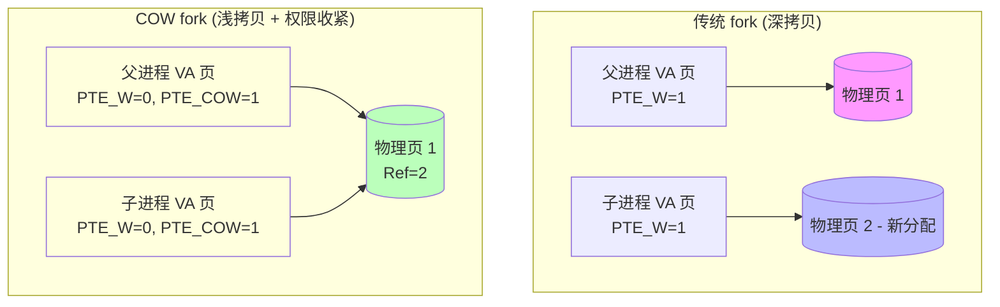
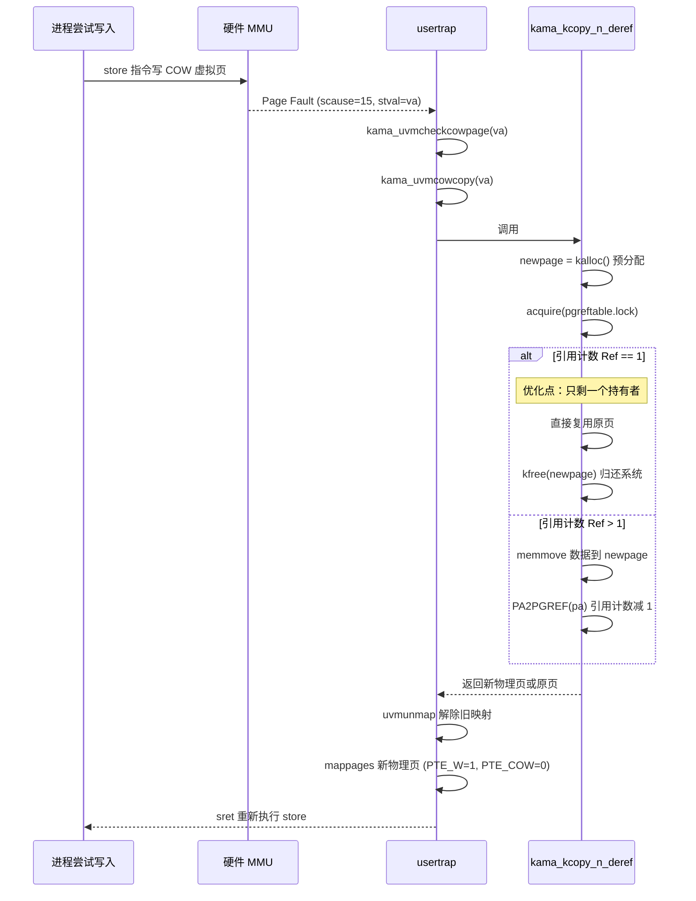
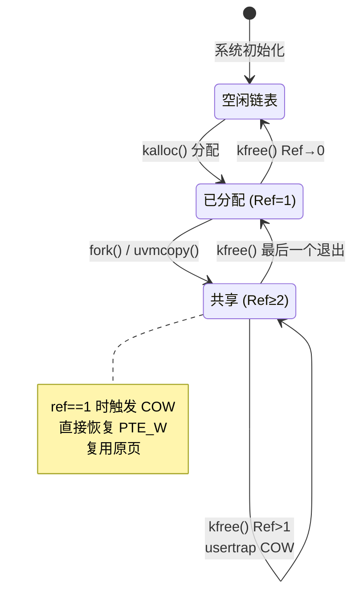

# Lab 8: Copy-on-Write Fork

## 任务描述

### 任务一：引用计数与 COW 基础设施 (Moderate)
在 `kalloc.c` 中实现引用计数数组，实现 `kama_krefpage` 和 `kama_kcopy_n_deref`。

### 任务二：修改 uvmcopy (Moderate)
`fork()` 时不拷贝物理页，改为共享 + 清除 `PTE_W` + 设置 `PTE_COW` 标志。

### 任务三：Page Fault 处理与 copyout 补丁 (Hard)
在 `usertrap` 中捕获 COW Page Fault，在 `copyout` 中手动触发 COW 逻辑。

---

## 核心实现

### PTE_COW 标志位

```c
// kernel/riscv.h
#define PTE_COW (1L << 8)  // 使用 RSW 位
```

### kalloc — 引用计数初始化

```c
// kernel/kalloc.c
#define PA2PGREF_ID(p) (((uint64)p - KERNBASE) / PGSIZE)
#define PGREF_MAX_ENTRIES PA2PGREF_ID(PHYSTOP)

struct {
    struct spinlock lock;
    int pageref[PGREF_MAX_ENTRIES];
} pgreftable;

void kinit(void) {
    initlock(&kmem.lock, "kmem");
    initlock(&pgreftable.lock, "pgref");
    freerange(end, (void*)PHYSTOP);
}

void freerange(void *pa_start, void *pa_end) {
    for(char *p = (char*)PGROUNDUP((uint64)pa_start);
        p + PGSIZE <= (char*)pa_end; p += PGSIZE) {
        PA2PGREF(p) = 1;  // 启动时预设为1，使 kfree 能正确递减至0并回收
        kfree(p);
    }
}

void *kalloc(void) {
    struct run *r;
    acquire(&kmem.lock);
    r = kmem.freelist;
    if(r) kmem.freelist = r->next;
    release(&kmem.lock);

    if(r) {
        memset((char*)r, 5, PGSIZE);
        PA2PGREF(r) = 1;  // 新分配页，引用数为 1
    }
    return (void*)r;
}
```

### kfree — 引用计数释放

```c
// kernel/kalloc.c
void kfree(void *pa) {
    if(((uint64)pa % PGSIZE) != 0 || (char*)pa < end || (uint64)pa >= PHYSTOP)
        panic("kfree");

    acquire(&pgreftable.lock);
    if(--PA2PGREF(pa) <= 0) {
        release(&pgreftable.lock);
        memset(pa, 1, PGSIZE);
        struct run *r = (struct run*)pa;
        acquire(&kmem.lock);
        r->next = kmem.freelist;
        kmem.freelist = r;
        release(&kmem.lock);
    } else {
        release(&pgreftable.lock);
    }
}
```

### kama_krefpage / kama_kcopy_n_deref

```c
// kernel/kalloc.c
void kama_krefpage(void *pa) {
    acquire(&pgreftable.lock);
    if(PA2PGREF(pa) < 1) panic("kama_krefpage: ref < 1");
    PA2PGREF(pa)++;
    release(&pgreftable.lock);
}

// ref==1 时直接复用旧页（无需分配）；ref>1 时拷贝到新页
void *kama_kcopy_n_deref(void *pa) {
    void *newpage = kalloc();  // 预分配策略：先在锁外申请

    acquire(&pgreftable.lock);
    if(PA2PGREF(pa) <= 1) {
        release(&pgreftable.lock);
        if(newpage) kfree(newpage);  // 归还备用页
        return pa;  // 优化：只剩一个持有者，直接复用
    }
    if(newpage == 0) {
        release(&pgreftable.lock);
        return 0;  // OOM
    }
    memmove(newpage, pa, PGSIZE);
    PA2PGREF(pa)--;
    release(&pgreftable.lock);
    return newpage;
}
```

### uvmcopy — COW 共享

```c
// kernel/vm.c
int uvmcopy(pagetable_t old, pagetable_t new, uint64 sz) {
    pte_t *pte; uint64 pa, i; uint flags;

    for(i = 0; i < sz; i += PGSIZE) {
        if((pte = walk(old, i, 0)) == 0) panic("uvmcopy: pte should exist");
        if((*pte & PTE_V) == 0) panic("uvmcopy: page not present");

        pa = PTE2PA(*pte);

        if(*pte & PTE_W) {
            *pte = (*pte & ~PTE_W) | PTE_COW;  // 父子双向标记为 COW
        }

        flags = PTE_FLAGS(*pte);
        if(mappages(new, i, PGSIZE, pa, flags) != 0) goto err;

        kama_krefpage((void*)pa);  // 引用计数 +1
    }
    return 0;

err:
    uvmunmap(new, 0, i / PGSIZE, 1);
    return -1;
}
```

### usertrap — COW Page Fault 处理

```c
// kernel/trap.c — usertrap()
} else if(scause == 15 && kama_uvmcheckcowpage(r_stval())) {
    if(kama_uvmcowcopy(r_stval()) == -1)
        p->killed = 1;
}

// kernel/vm.c
int kama_uvmcheckcowpage(uint64 va) {
    struct proc *p = myproc();
    pte_t *pte;
    return (va < p->sz)
        && ((pte = walk(p->pagetable, va, 0)) != 0)
        && (*pte & PTE_V)
        && (*pte & PTE_COW);
}

int kama_uvmcowcopy(uint64 va) {
    struct proc *p = myproc();
    pte_t *pte = walk(p->pagetable, PGROUNDDOWN(va), 0);
    if(pte == 0) return -1;

    uint64 pa = PTE2PA(*pte);
    void *newpa = kama_kcopy_n_deref((void*)pa);
    if(newpa == 0) return -1;

    uint64 flags = (PTE_FLAGS(*pte) | PTE_W) & ~PTE_COW;
    uvmunmap(p->pagetable, PGROUNDDOWN(va), 1, 0);  // 解除旧映射（不释放物理页）
    if(mappages(p->pagetable, PGROUNDDOWN(va), PGSIZE,
                (uint64)newpa, flags) == -1) {
        kfree(newpa); return -1;
    }
    return 0;
}
```

### copyout — 内核补丁

```c
// kernel/vm.c
int copyout(pagetable_t pt, uint64 dstva, char *src, uint64 len) {
    while(len > 0) {
        uint64 va0 = PGROUNDDOWN(dstva);
        // 内核写入不走 MMU 中断，手动触发 COW 处理
        if(kama_uvmcheckcowpage(va0)) {
            if(kama_uvmcowcopy(va0) == -1) return -1;
        }
        uint64 pa0 = walkaddr(pt, va0);
        if(pa0 == 0) return -1;
        // ... 拷贝逻辑 ...
    }
}
```

---

## 架构与流程图

### COW Fork — fork 前后页表状态变化



### COW Fork — Page Fault 触发与处理流程



### 引用计数状态机



---

## 关键设计点

### 1. 预分配策略（kama_kcopy_n_deref）
在持有 `pgreftable.lock` 之前调用 `kalloc()`（内部用 `kmem.lock`），避免同时持有两把锁造成的 AB-BA 死锁。

### 2. ref==1 优化
最后一个持有者写入时无需真正拷贝——直接恢复 `PTE_W` 并复用原页，避免无意义的内存分配。

### 3. copyout 盲区
内核写入用户地址不触发硬件 Page Fault，必须在 `copyout` 中手动检查并触发 COW 逻辑，否则数据静默写入旧物理页。

### 4. uvmunmap do_free=0（uvmcowcopy）
解除旧映射时传 `do_free=0`，因为 `kama_kcopy_n_deref` 内部已经递减了引用计数，不需要 `kfree` 重复处理。

### 5. 启动期初始化（freerange）
`kfree` 依赖引用计数从 1 递减到 0 才回收，`freerange` 阶段预设为 1 确保所有页能正确进入空闲链表。
