# xv6-riscv Labs

📚 MIT 6.S081 xv6-riscv 实验学习笔记

🔗 xv6 源码：[mit-pdos/xv6-riscv](https://github.com/mit-pdos/xv6-riscv)（submodule）
📖 官方实验要求：[MIT 6.S081 Lab (2020)](https://pdos.csail.mit.edu/6.828/2020/labs/)

---

## 仓库结构

```
xv6-riscv-labs/
├── README.md                       ← 课程全景总结 + 8 实验总览
├── xv6-riscv/                      ← xv6 源码（submodule）
└── labs/
    ├── README.md                   ← 课程全景图 + 核心概念总结
    ├── 01-xv6-and-unix-utilities/ ← sleep / pingpong / primes / find / xargs
    ├── 02-system-calls/            ← trace / sysinfo
    ├── 03-traps/                  ← backtrace / alarm
    ├── 04-multithreading/          ← uthread / hash table / barrier
    ├── 05-lazy-allocation/         ← 惰性分配 + Page Fault
    ├── 06-page-tables/             ← vmprint / per-process kpagetable / copyin_new
    ├── 07-locks/                  ← Per-CPU allocator / buffer cache
    └── 08-copy-on-write-fork/     ← COW Fork + 引用计数
```

每个实验目录包含：
- `README.md`：任务描述 + 核心代码 + Mermaid 架构/流程图

---

## 课程全景图

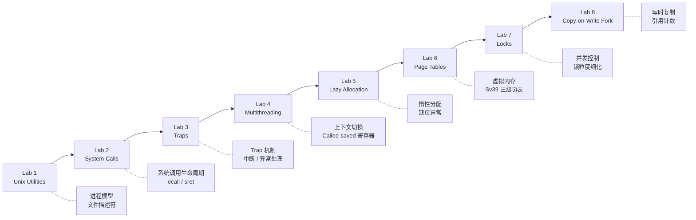
```mermaid
graph LR
    L1[Lab 1<br/>Unix Utilities] --> L2[Lab 2<br/>System Calls]
    L2 --> L3[Lab 3<br/>Traps]
    L3 --> L4[Lab 4<br/>Multithreading]
    L4 --> L5[Lab 5<br/>Lazy Allocation]
    L5 --> L6[Lab 6<br/>Page Tables]
    L6 --> L7[Lab 7<br/>Locks]
    L7 --> L8[Lab 8<br/>Copy-on-Write Fork]

    L1 -.- C1[进程模型<br/>文件描述符]
    L2 -.- C2[系统调用生命周期<br/>ecall / sret]
    L3 -.- C3[Trap 机制<br/>中断 / 异常处理]
    L4 -.- C4[上下文切换<br/>Callee-saved 寄存器]
    L5 -.- C5[惰性分配<br/>缺页异常]
    L6 -.- C6[虚拟内存<br/>Sv39 三级页表]
    L7 -.- C7[并发控制<br/>锁粒度细化]
    L8 -.- C8[写时复制<br/>引用计数]
```

---

# Lab 1 — Unix Utilities：系统编程的破冰

核心任务：实现 `sleep` `pingpong` `primes` `find` `xargs`，建立"用户态程序员"的思维模型。

---

## Part 1：Boot xv6 与 sleep — 跨越用户态与内核态的边界

### Boot xv6：你的代码跑在哪里？

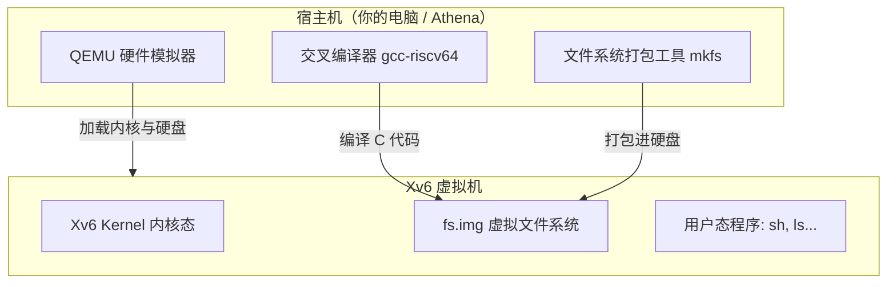
```mermaid
graph TD
    subgraph Host[宿主机（你的电脑 / Athena）]
        GCC[交叉编译器 gcc-riscv64]
        MKFS[文件系统打包工具 mkfs]
        QEMU[QEMU 硬件模拟器]
    end

    subgraph Guest[Xv6 虚拟机]
        Kernel[Xv6 Kernel 内核态]
        FS[fs.img 虚拟文件系统]
        User[用户态程序: sh, ls...]
    end

    GCC --> |编译 C 代码| FS
    MKFS --> |打包进硬盘| FS
    QEMU --> |加载内核与硬盘| Guest
```

`make qemu` 经历完整构建链：编译 → 链接 → `mkfs` 打包成 `fs.img` → QEMU 模拟 RISC-V CPU 启动。

### sleep 实验的启示：exit() 的绝对必要性

在裸机环境中，程序执行完毕后若没有显式 `exit()`，CPU 会继续执行内存中的未知指令，直接崩溃。

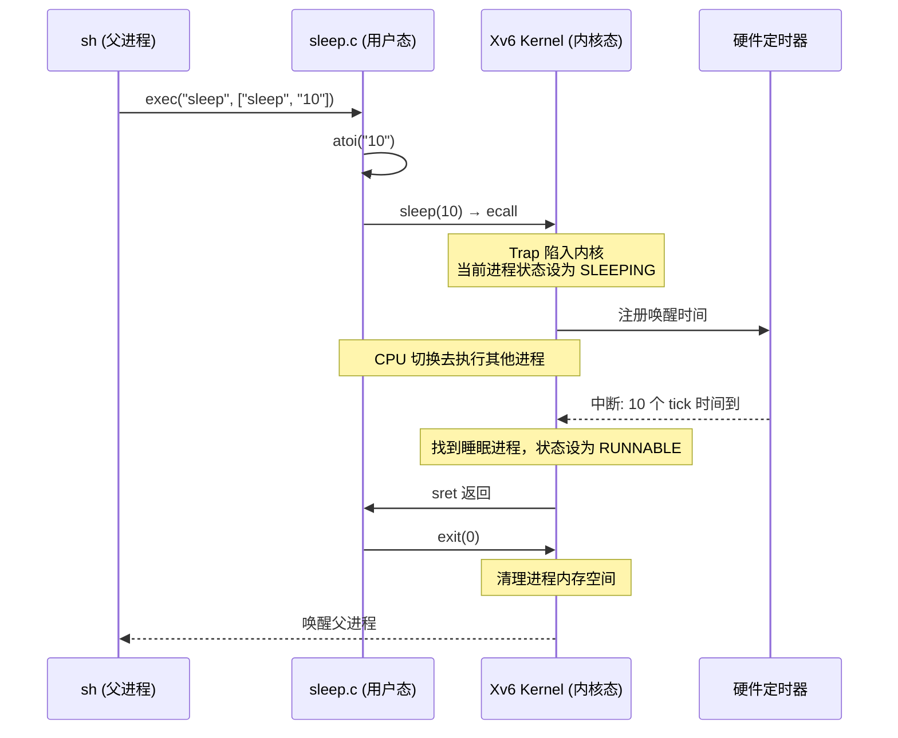
```mermaid
sequenceDiagram
    participant Shell as sh (父进程)
    participant User as sleep.c (用户态)
    participant Kernel as Xv6 Kernel (内核态)
    participant Timer as 硬件定时器

    Shell->>User: exec("sleep", ["sleep", "10"])

    User->>User: atoi("10")
    User->>Kernel: sleep(10) → ecall

    Note over Kernel: Trap 陷入内核<br/>当前进程状态设为 SLEEPING
    Kernel->>Timer: 注册唤醒时间

    Note over User,Kernel: CPU 切换去执行其他进程

    Timer-->>Kernel: 中断: 10 个 tick 时间到
    Note over Kernel: 找到睡眠进程，状态设为 RUNNABLE
    Kernel->>User: sret 返回

    User->>Kernel: exit(0)
    Note over Kernel: 清理进程内存空间
    Kernel-->>Shell: 唤醒父进程
```

---

## Part 2：pingpong 与 primes — 进程与管道的艺术

**核心敌人**：死锁（Deadlock）和资源泄漏（Resource Leak）。唯一武器：对**文件描述符（FD）生命周期**的绝对掌控。

### pingpong：双向通信与"僵尸引用"的启蒙

**"僵尸引用"导致无限阻塞（死锁）**：`fork()` 后若不去关闭不需要的读端/写端，管道的"引用计数"永远大于 0。EOF 的真相是——**只有当所有写端都被关闭时，`read()` 才解除阻塞并返回 0**。

**黄金法则：Close Early, Close Often**。`fork()` 之后的第一件事，就是父子进程各自关闭自己绝对不会用到的那一端。

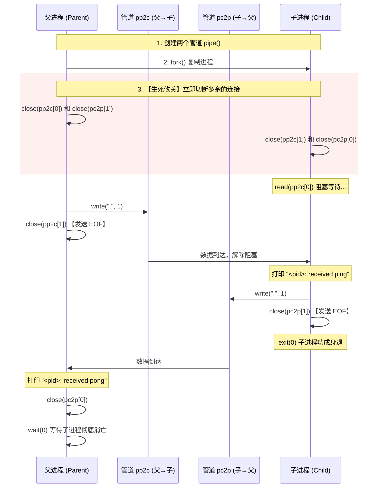
```mermaid
sequenceDiagram
    participant P as 父进程 (Parent)
    participant Pipe1 as 管道 pp2c (父→子)
    participant Pipe2 as 管道 pc2p (子→父)
    participant C as 子进程 (Child)

    Note over P, C: 1. 创建两个管道 pipe()
    P->>C: 2. fork() 复制进程

    rect rgb(255, 240, 240)
    Note over P, C: 3. 【生死攸关】立即切断多余的连接
    P->>P: close(pp2c[0]) 和 close(pc2p[1])
    C->>C: close(pp2c[1]) 和 close(pc2p[0])
    end

    Note over C: read(pp2c[0]) 阻塞等待...
    P->>Pipe1: write(".", 1)
    P->>P: close(pp2c[1]) 【发送 EOF】
    Pipe1->>C: 数据到达，解除阻塞

    Note over C: 打印 "<pid>: received ping"

    C->>Pipe2: write(".", 1)
    C->>C: close(pc2p[1]) 【发送 EOF】
    Note over C: exit(0) 子进程功成身退

    Pipe2->>P: 数据到达
    Note over P: 打印 "<pid>: received pong"
    P->>P: close(pc2p[0])
    P->>P: wait(0) 等待子进程彻底消亡
```

### primes：并发流水线的巅峰（最具挑战性）

每个进程只干一件事——记住收到的第一个数字 $p$（必为质数），把不能被 $p$ 整除的数字传给下一个进程。

从哨兵 `-1` 到 Unix 哲学 `EOF`：只要上一级 `close(写端)`，`read()` 自动返回 0。无需自定义结束符。

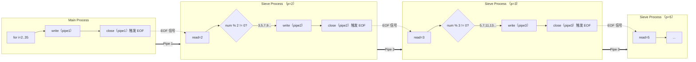
```mermaid
graph LR
    subgraph P_Main[Main Process]
        Start[for i=2..35] --> W_M[write（pipe1）]
        W_M --> Close_M[close（pipe1）触发 EOF]
    end

    subgraph P_2[Sieve Process （p=2）]
        R_2[read=2] --> W_2{num % 2 != 0?}
        W_2 -- 3,5,7,9... --> W_P2[write（pipe2）]
        Close_M -. EOF 信号 .-> R_2
        W_P2 --> Close_2[close（pipe2）触发 EOF]
    end

    subgraph P_3[Sieve Process （p=3）]
        R_3[read=3] --> W_3{num % 3 != 0?}
        W_3 -- 5,7,11,13... --> W_P3[write（pipe3）]
        Close_2 -. EOF 信号 .-> R_3
        W_P3 --> Close_3[close（pipe3）触发 EOF]
    end

    subgraph P_5[Sieve Process （p=5）]
        R_5[read=5] --> Next[...]
        Close_3 -. EOF 信号 .-> R_5
    end

    P_Main ==> |Pipe 1| P_2
    P_2 ==> |Pipe 2| P_3
    P_3 ==> |Pipe 3| P_5
```

**级联等待**：每层递归末尾必须 `wait(0)`，保证流水线像多米诺骨牌一样优雅结束。Xv6 每个进程最多 16 个 FD——到了质数 13/17 时若不关闭多余端口，系统报 `fork failed`。

---

## Part 3：find 与 xargs — 文件系统与命令执行

### find：深度优先探索（DFS）

**核心教训**：`memmove(p, de.name, DIRSIZ); p[DIRSIZ] = 0;`。底层固定长度字符数组（14字节）可能没有 `\0` 结束符，必须手动截断并加上 `0`，否则导致缓冲区溢出。

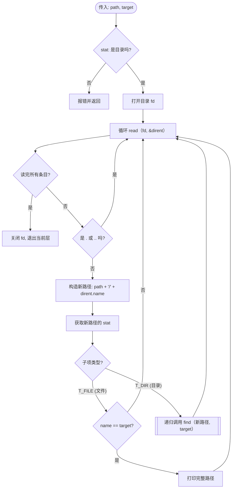
```mermaid
graph TD
    Start([传入: path, target]) --> CheckType{stat: 是目录吗?}

    CheckType -- 否 --> Exit[报错并返回]
    CheckType -- 是 --> OpenDir[打开目录 fd]

    OpenDir --> ReadLoop[循环 read（fd, &dirent）]

    ReadLoop --> IsEnd{读完所有条目?}
    IsEnd -- 是 --> CloseDir[关闭 fd, 退出当前层]

    IsEnd -- 否 --> Filter{是 . 或 .. 吗?}
    Filter -- 是 --> ReadLoop

    Filter -- 否 --> BuildPath[构造新路径: path + '/' + dirent.name]
    BuildPath --> GetStat[获取新路径的 stat]

    GetStat --> CheckChild{子项类型?}
    CheckChild -- T_FILE (文件) --> MatchName{name == target?}
    MatchName -- 是 --> Print[打印完整路径]
    MatchName -- 否 --> ReadLoop
    Print --> ReadLoop

    CheckChild -- T_DIR (目录) --> Recurse[[递归调用 find（新路径, target）]]
    Recurse --> ReadLoop
```

### xargs：动态参数装配流水线

**关键顿悟**：`argc` 是启动时固定的静态值；`xargs` 动态维护指针数组 `argsbuf`，把读取的每一行像补丁一样贴进去。`exec(cmd, argv)` 沿指针数组往下读，**直到撞见 NULL 为止**——忘记 `*pa = 0` 则内存越界。

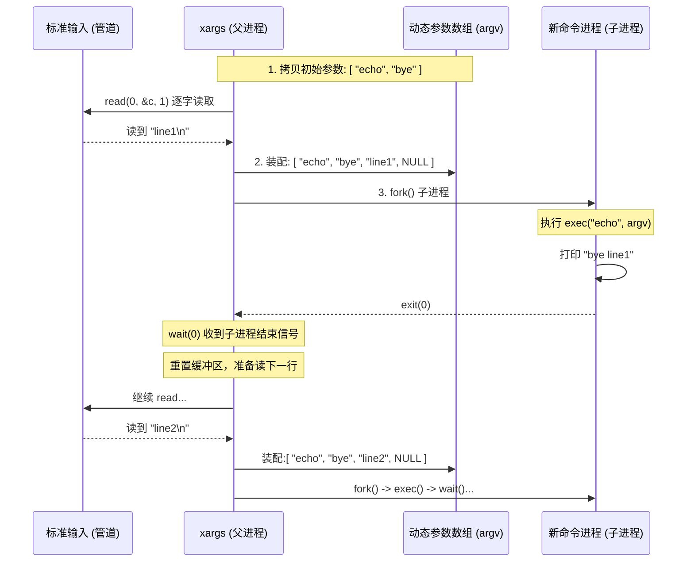
```mermaid
sequenceDiagram
    participant Stdin as 标准输入 (管道)
    participant Xargs as xargs (父进程)
    participant Mem as 动态参数数组 (argv)
    participant Cmd as 新命令进程 (子进程)

    Note over Xargs, Mem: 1. 拷贝初始参数: [ "echo", "bye" ]

    Xargs->>Stdin: read(0, &c, 1) 逐字读取
    Stdin-->>Xargs: 读到 "line1\n"

    Xargs->>Mem: 2. 装配: [ "echo", "bye", "line1", NULL ]

    Xargs->>Cmd: 3. fork() 子进程

    Note over Cmd: 执行 exec("echo", argv)
    Cmd->>Cmd: 打印 "bye line1"
    Cmd-->>Xargs: exit(0)

    Note over Xargs: wait(0) 收到子进程结束信号
    Note over Xargs: 重置缓冲区，准备读下一行

    Xargs->>Stdin: 继续 read...
    Stdin-->>Xargs: 读到 "line2\n"
    Xargs->>Mem: 装配:[ "echo", "bye", "line2", NULL ]
    Xargs->>Cmd: fork() -> exec() -> wait()...
```

### 终极操作系统心法

> **一切皆文件**：目录、终端、管道都是文件。掌握 `open/read/write/close` 四系统调用即操控整个计算机数据流。
>
> **管道与组合哲学**：程序强大不来源于自身复杂，而来源于组合。用 `|` 将微小专注的程序串联。
>
> **极度的资源洁癖**：在底层世界没有 GC。`fork` 必须 `wait`，`pipe` 不用必须 `close`，字符串必须亲手标 `\0`。

---

# Lab 2 — System Calls：向内核插入自定义代码

核心任务：添加 `trace` 和 `sysinfo` 系统调用，理解添加系统调用的完整流程。

## 添加系统调用的五个步骤

1. `kernel/syscall.h` — 分配编号 `SYS_xxx`
2. `user/user.h` — 声明用户态函数原型
3. `user/usys.pl` — 添加 `entry("xxx")`（Perl 生成汇编跳板）
4. `kernel/syscall.c` — 注册函数到 `syscalls[]` 数组
5. `kernel/sysproc.c` — 实现具体逻辑

**添加新 syscall 无需修改 Trampoline 或 Trap**：Trap 机制是稳定的底层框架，上层功能在其上"插桩"即可。

---

# Lab 2 补充 — 系统调用全生命周期：Trapframe 与 Context 的双环流转

这是整个 xv6 内核最核心的运行机制。`ecall` → `uservec` → `usertrap` → `syscall` → `usertrapret` → `userret` → `sret`，每一步都有严格的状态机切换。

## 完整时序图（Trapframe × Context × 物理 CPU 三位一体）

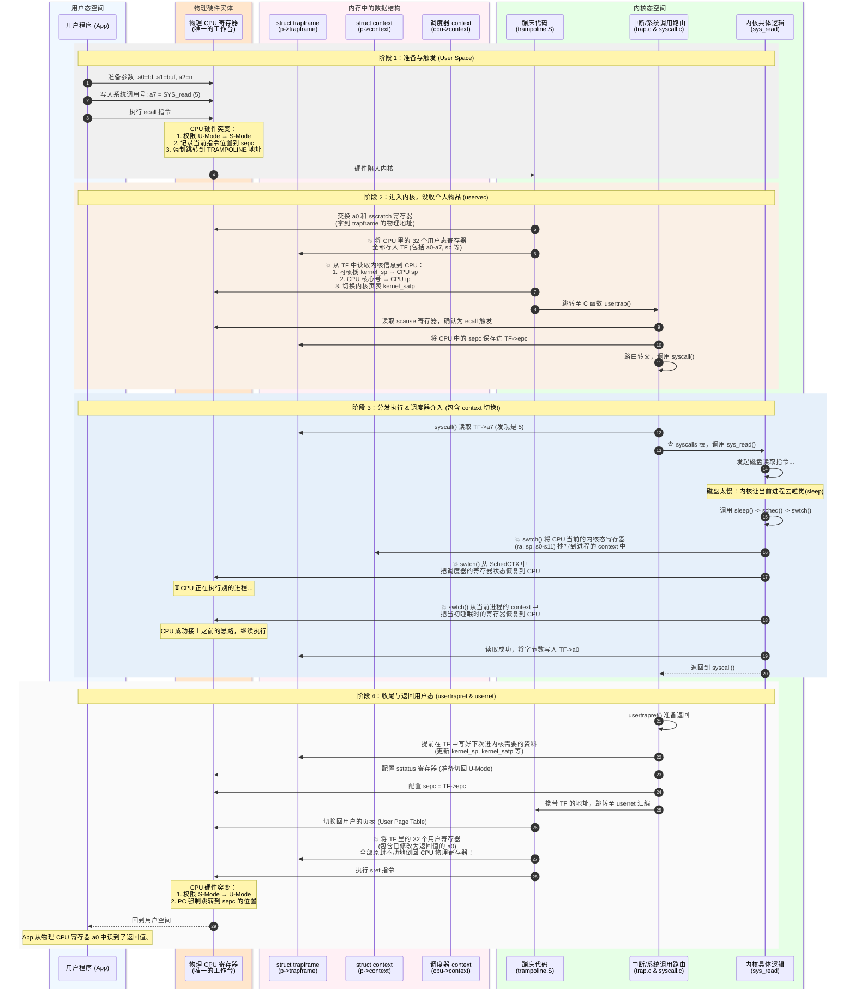
```mermaid
sequenceDiagram
    autonumber

    box rgb(240, 248, 255) 用户态空间
        participant App as 用户程序 (App)
    end

    box rgb(255, 230, 204) 物理硬件实体
        participant CPU as 物理 CPU 寄存器<br>(唯一的工作台)
    end

    box rgb(255, 240, 245) 内存中的数据结构
        participant TF as struct trapframe<br>(p->trapframe)
        participant CTX as struct context<br>(p->context)
        participant SchedCTX as 调度器 context<br>(cpu->context)
    end

    box rgb(230, 255, 230) 内核态空间
        participant Tramp as 蹦床代码<br>(trampoline.S)
        participant Trap as 中断/系统调用路由<br>(trap.c & syscall.c)
        participant SysProc as 内核具体逻辑<br>(sys_read)
    end

    %% 阶段一：准备与触发
    rect rgb(240, 240, 240)
    Note over App, SysProc: 阶段 1：准备与触发 (User Space)
    App->>CPU: 准备参数: a0=fd, a1=buf, a2=n
    App->>CPU: 写入系统调用号: a7 = SYS_read (5)
    App->>CPU: 执行 ecall 指令
    Note over CPU: CPU 硬件突变：<br>1. 权限 U-Mode → S-Mode<br>2. 记录当前指令位置到 sepc<br>3. 强制跳转到 TRAMPOLINE 地址
    CPU-->>Tramp: 硬件陷入内核
    end

    %% 阶段二：进入内核
    rect rgb(250, 240, 230)
    Note over App, SysProc: 阶段 2：进入内核，没收个人物品 (uservec)
    Tramp->>CPU: 交换 a0 和 sscratch 寄存器<br>(拿到 trapframe 的物理地址)
    Tramp->>TF: 💥 将 CPU 里的 32 个用户态寄存器<br>全部存入 TF (包括 a0-a7, sp 等)
    Tramp->>CPU: 💥 从 TF 中读取内核信息到 CPU：<br>1. 内核栈 kernel_sp → CPU sp<br>2. CPU 核心号 → CPU tp<br>3. 切换内核页表 kernel_satp
    Tramp->>Trap: 跳转至 C 函数 usertrap()

    Trap->>CPU: 读取 scause 寄存器，确认为 ecall 触发
    Trap->>TF: 将 CPU 中的 sepc 保存进 TF->epc
    Trap->>Trap: 路由转交，调用 syscall()
    end

    %% 阶段三：分发执行与上下文切换
    rect rgb(230, 240, 250)
    Note over App, SysProc: 阶段 3：分发执行 & 调度器介入 (包含 context 切换!)
    Trap->>TF: syscall() 读取 TF->a7 (发现是 5)
    Trap->>SysProc: 查 syscalls 表，调用 sys_read()

    SysProc->>SysProc: 发起磁盘读取指令...
    Note over SysProc: 磁盘太慢！内核让当前进程去睡觉(sleep)
    SysProc->>SysProc: 调用 sleep() -> sched() -> swtch()

    SysProc->>CTX: 💥 swtch() 将 CPU 当前的内核态寄存器<br>(ra, sp, s0-s11) 抄写到进程的 context 中
    SysProc->>CPU: 💥 swtch() 从 SchedCTX 中<br>把调度器的寄存器状态恢复到 CPU

    Note over CPU: ⏳ CPU 正在执行别的进程...

    SysProc->>CPU: 💥 swtch() 从当前进程的 context 中<br>把当初睡眠时的寄存器恢复到 CPU
    Note over CPU: CPU 成功接上之前的思路，继续执行

    SysProc->>TF: 读取成功，将字节数写入 TF->a0
    SysProc-->>Trap: 返回到 syscall()
    end

    %% 阶段四：收尾与返回
    rect rgb(250, 250, 250)
    Note over App, SysProc: 阶段 4：收尾与返回用户态 (usertrapret & userret)
    Trap->>Trap: usertrapret() 准备返回
    Trap->>TF: 提前在 TF 中写好下次进内核需要的资料<br>(更新 kernel_sp, kernel_satp 等)
    Trap->>CPU: 配置 sstatus 寄存器 (准备切回 U-Mode)
    Trap->>CPU: 配置 sepc = TF->epc
    Trap->>Tramp: 携带 TF 的地址，跳转至 userret 汇编

    Tramp->>CPU: 切换回用户的页表 (User Page Table)
    Tramp->>TF: 💥 将 TF 里的 32 个用户寄存器<br>(包含已修改为返回值的 a0)<br>全部原封不动地倒回 CPU 物理寄存器！
    Tramp->>CPU: 执行 sret 指令
    Note over CPU: CPU 硬件突变：<br>1. 权限 S-Mode → U-Mode<br>2. PC 强制跳转到 sepc 的位置
    CPU-->>App: 回到用户空间
    Note over App: App 从物理 CPU 寄存器 a0 中读到了返回值。
    end
```

### 图表高光细节解读

**为什么 `TF->a0` 是系统调用的灵魂？**
- 进去时：App 把文件描述符 `fd` 放在物理 `a0` 里，`uservec` 把这个物理 `a0` 存进 `TF->a0`。
- 出来时：`sys_read` 把读取的字节数写进 `TF->a0`（覆盖了原来的 `fd`）。
- `userret` 把 `TF` 里的数据还原，物理 `a0` 变成返回值。

**Trapframe 的双向属性（两次 💥 大爆炸）**：
- **没收个人物品**：把属于用户的"脏乱差"数据全部打包进 `TF`，给内核腾出干净的物理 CPU。
- **归还个人物品**：把 `TF` 里的数据还原，让用户程序感觉"就像什么事都没发生过"。

**Context 的登场时机**：当系统调用需要等待（等磁盘）时，`trapframe` 里的数据静静躺着不用动（用户状态已保存）。内核需要保存的是"当前内核执行到了哪一步"，所以用 `swtch()` 把内核寄存器存进 `p->context`。**`trapframe` 管"用户↔内核"跨界，`context` 管"内核↔内核"交接班。**

---

# Lab 3 — Traps：CPU 异常与中断处理

核心任务：理解 RISC-V Trap 全生命周期，实现 `backtrace` 和 `alarm` 定时回调。

## Alarm 实验全流程（含防重入机制）

### 1. Alarm 全生命周期时序图

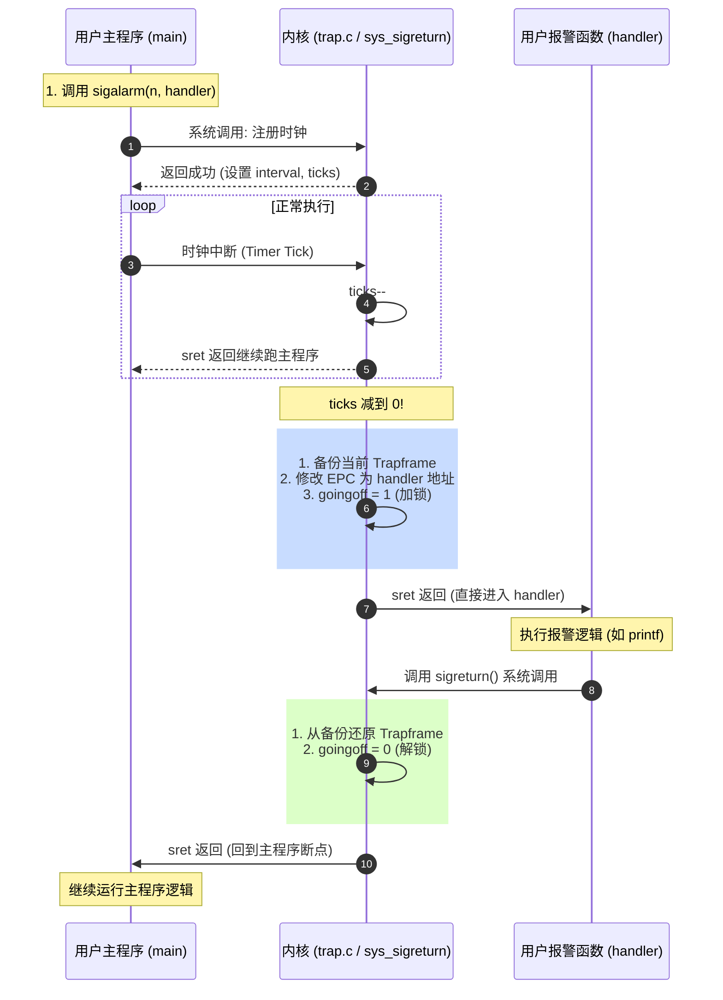
```mermaid
sequenceDiagram
    autonumber
    participant U as 用户主程序 (main)
    participant K as 内核 (trap.c / sys_sigreturn)
    participant H as 用户报警函数 (handler)

    Note over U: 1. 调用 sigalarm(n, handler)
    U->>K: 系统调用: 注册时钟
    K-->>U: 返回成功 (设置 interval, ticks)

    loop 正常执行
        U->>K: 时钟中断 (Timer Tick)
        K->>K: ticks--
        K-->>U: sret 返回继续跑主程序
    end

    Note over K: ticks 减到 0!
    rect rgb(200, 220, 255)
    K->>K: 1. 备份当前 Trapframe<br/>2. 修改 EPC 为 handler 地址<br/>3. goingoff = 1 (加锁)
    end
    K->>H: sret 返回 (直接进入 handler)

    Note over H: 执行报警逻辑 (如 printf)
    H->>K: 调用 sigreturn() 系统调用

    rect rgb(220, 255, 200)
    K->>K: 1. 从备份还原 Trapframe<br/>2. goingoff = 0 (解锁)
    end
    K->>U: sret 返回 (回到主程序断点)

    Note over U: 继续运行主程序逻辑
```

### 2. usertrap 触发逻辑流程图

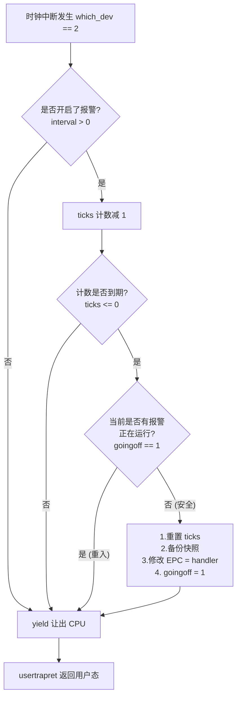
```mermaid
flowchart TD
    Start[时钟中断发生 which_dev == 2] --> IsAlarm{是否开启了报警?<br/>interval > 0}
    IsAlarm -- 否 --> Yield[yield 让出 CPU]
    IsAlarm -- 是 --> TickDec[ticks 计数减 1]

    TickDec --> TimeUp{计数是否到期?<br/>ticks <= 0}
    TimeUp -- 否 --> Yield
    TimeUp -- 是 --> IsRunning{当前是否有报警<br/>正在运行?<br/>goingoff == 1}

    IsRunning -- 是 (重入) --> Yield
    IsRunning -- 否 (安全) --> Trigger[1.重置 ticks<br/>2.备份快照<br/>3.修改 EPC = handler<br/>4. goingoff = 1]

    Trigger --> Yield
    Yield --> End[usertrapret 返回用户态]
```

### 3. 陷阱帧备份与还原

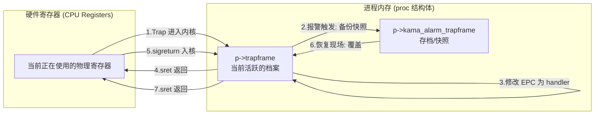
```mermaid
graph LR
    subgraph "硬件寄存器 (CPU Registers)"
        REG[当前正在使用的物理寄存器]
    end

    subgraph "进程内存 (proc 结构体)"
        TF[p->trapframe<br/>当前活跃的档案]
        BTF[p->kama_alarm_trapframe<br/>存档/快照]
    end

    REG -- "1.Trap 进入内核" --> TF
    TF -- "2.报警触发: 备份快照" --> BTF
    TF -- "3.修改 EPC 为 handler" --> TF
    TF -- "4.sret 返回" --> REG

    REG -- "5.sigreturn 入核" --> TF
    BTF -- "6.恢复现场: 覆盖" --> TF
    TF -- "7.sret 返回" --> REG
```

### 4. 防止重入（goingoff 标志位）

| 场景 | `goingoff` 状态 | 行为 | 目的 |
|------|----------------|------|------|
| 正常运行 | `0` | 计数器正常倒计时 | 监控 CPU 时间 |
| 触发瞬间 | `0 → 1` | 备份现场，跳转到 `handler` | 开始执行报警逻辑 |
| Handler 运行中 | `1` | 计数器再次到期也**不再备份现场** | 保护备份帧不被覆盖 |
| Sigreturn 时 | `1 → 0` | 还原现场，允许下一次报警 | 任务完成，恢复监控 |

### 避坑指南

1. **返回值传递**：`sys_sigreturn` 返回值存入 `a0`，直接 `return 0` 会让主程序恢复后 `a0=0`。对策：返回 `p->trapframe->a0`。
2. **计数器重置**：触发跳转时立即重置 `p->kama_alarm_ticks = interval`。
3. **内存管理**：`allocproc` 里分配 `p->kama_alarm_trapframe`，`freeproc` 里释放。

---

# Lab 4 — Multithreading：用户态线程切换

核心任务：在用户态实现线程库 `uthread`，编写汇编 `thread_switch.S`。

## Part 1：Uthread — 线程的物理本质

线程 = 一段执行代码 + 一个私有栈 + 一组寄存器快照。

### Callee-saved vs Caller-saved

**Caller-saved（调用者保存）**：`a0-a7`, `t0-t6`。C 语言调用函数前，编译器自动把它们压栈。

**Callee-saved（被调用者保存）**：`s0-s11`, `sp`, `ra`。必须由函数自身保证执行前后不变。

`thread_switch` 被当作普通 C 函数调用，**只存 14 个 Callee-saved 寄存器**，效率最优。

### 栈的生长方向与 16 字节对齐

栈从**高地址向低地址**生长，新线程的 `sp` 必须初始化为 `t->stack + STACK_SIZE`（最高处）。RISC-V 架构强制要求 `sp` 地址为 16 的倍数。

### 最巧妙的"骗局" — `ret` 指令

`thread_create` 时，将入口函数地址强行塞给 `context.ra`。当 `thread_switch` 第一次加载新线程并执行 `ret` 时，CPU 误以为是从某个函数返回，"瞬间移动"到了新线程的入口！

### Uthread 切换微观视角（寄存器搬运）

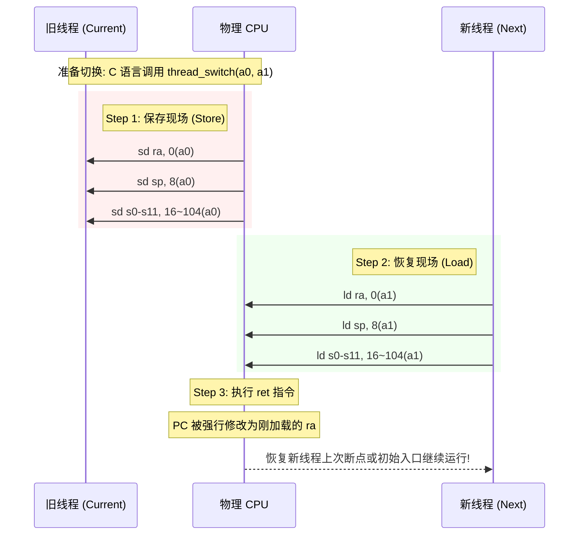
```mermaid
sequenceDiagram
    participant Old as 旧线程 (Current)
    participant CPU as 物理 CPU
    participant New as 新线程 (Next)

    Note over Old, CPU: 准备切换: C 语言调用 thread_switch(a0, a1)

    rect rgb(255, 240, 240)
    Note right of Old: Step 1: 保存现场 (Store)
    CPU->>Old: sd ra, 0(a0)
    CPU->>Old: sd sp, 8(a0)
    CPU->>Old: sd s0-s11, 16~104(a0)
    end

    rect rgb(240, 255, 240)
    Note left of New: Step 2: 恢复现场 (Load)
    New->>CPU: ld ra, 0(a1)
    New->>CPU: ld sp, 8(a1)
    New->>CPU: ld s0-s11, 16~104(a1)
    end

    Note over CPU: Step 3: 执行 ret 指令
    Note over CPU: PC 被强行修改为刚加载的 ra
    CPU-->>New: 恢复新线程上次断点或初始入口继续运行!
```

---

## Part 2：Using threads — 锁粒度演进与物理硬件的桎梏

### 锁粒度优化对比（Global vs. Fine-grained）

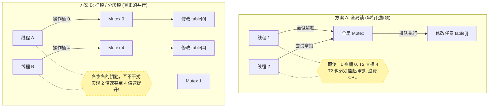
```mermaid
flowchart TD
    classDef note fill:#fff5ad,stroke:#f8d100,stroke-dasharray: 5 5, color:#333;

    subgraph S1 ["方案 A: 全局锁 (串行化瓶颈)"]
        GL[全局 Mutex]
        T1[线程 1] -- "尝试拿锁" --> GL
        T2[线程 2] -- "尝试拿锁" --> GL
        GL -- "排队执行" --> B_All["修改任意 table[i]"]

        Note1{{即使 T1 查桶 0, T2 查桶 4<br/>T2 也必须挂起睡觉, 浪费 CPU}}:::note
        T1 -.- Note1
        T2 -.- Note1
    end

    subgraph S2 ["方案 B: 桶锁 / 分段锁 (真正的并行)"]
        L0[Mutex 0]
        L1[Mutex 1]
        L4[Mutex 4]

        T3[线程 A] -- "操作桶 0" --> L0
        T4[线程 B] -- "操作桶 4" --> L4

        L0 --> B0["修改 table[0]"]
        L4 --> B4["修改 table[4]"]

        Note2{{各拿各的钥匙，互不干扰<br/>实现 2 倍速甚至 4 倍速提升!}}:::note
        T3 -.- Note2
        T4 -.- Note2
    end
```

**无锁编程（Lock-free）惊鸿一瞥**：RISC-V 的 `LR/SC`（Load-Reserved / Store-Conditional）指令对，或 CAS（Compare-and-Swap）。锁是"悲观"的（先阻塞），无锁是"乐观"的（先干活，冲突再重试）。

### 性能无法完美翻倍的幕后黑手：MESI 缓存一致性协议

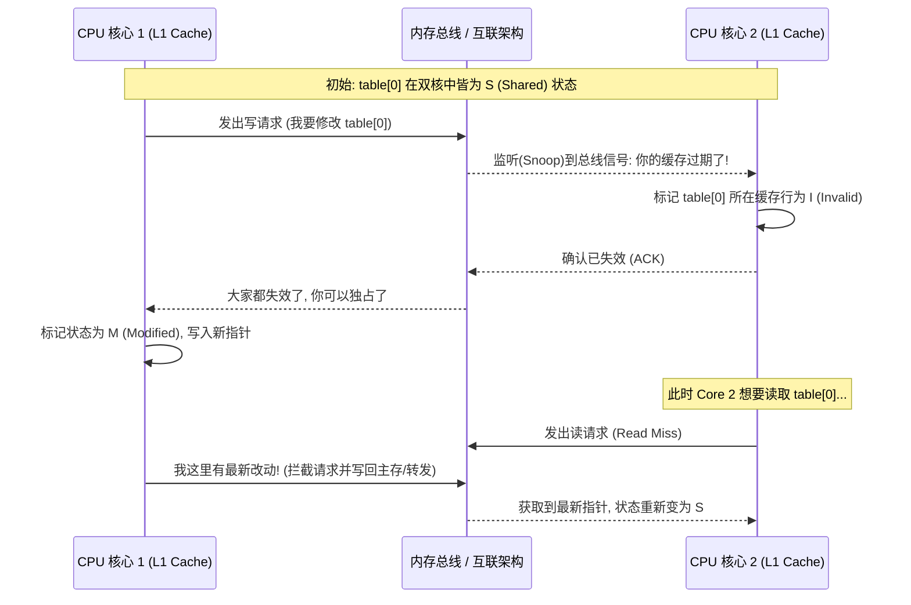
```mermaid
sequenceDiagram
    participant Core1 as CPU 核心 1 (L1 Cache)
    participant Bus as 内存总线 / 互联架构
    participant Core2 as CPU 核心 2 (L1 Cache)

    Note over Core1, Core2: 初始: table[0] 在双核中皆为 S (Shared) 状态

    Core1->>Bus: 发出写请求 (我要修改 table[0])

    Bus-->>Core2: 监听(Snoop)到总线信号: 你的缓存过期了!
    Core2->>Core2: 标记 table[0] 所在缓存行为 I (Invalid)
    Core2-->>Bus: 确认已失效 (ACK)

    Bus-->>Core1: 大家都失效了, 你可以独占了
    Core1->>Core1: 标记状态为 M (Modified), 写入新指针

    Note over Core2: 此时 Core 2 想要读取 table[0]...
    Core2->>Bus: 发出读请求 (Read Miss)
    Core1->>Bus: 我这里有最新改动! (拦截请求并写回主存/转发)
    Bus-->>Core2: 获取到最新指针, 状态重新变为 S
```

**伪共享（False Sharing）陷阱**：如果 `lock[0]` 和 `lock[1]` 处于同一个 64 字节缓存行，核心 A 拿 `lock[0]` 会导致核心 B 的整个缓存行失效。

---

## Part 3：Barrier — 同步哲学与 Linux 内核跨界联动

### Barrier 同步流（最后一人打扫战场）

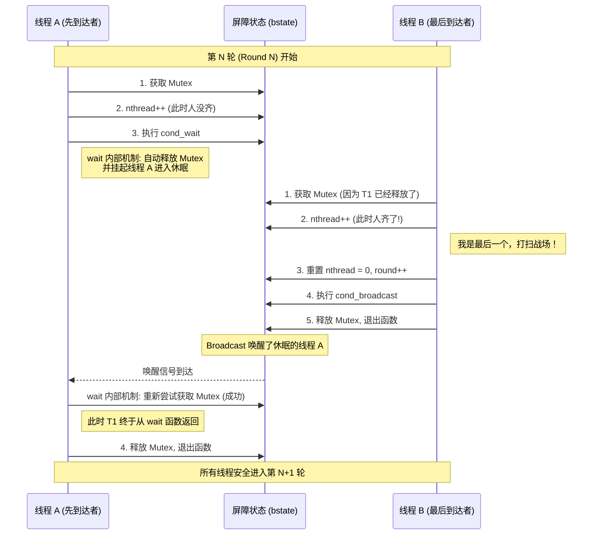
```mermaid
sequenceDiagram
    participant T1 as 线程 A (先到达者)
    participant BState as 屏障状态 (bstate)
    participant T2 as 线程 B (最后到达者)

    Note over T1, T2: 第 N 轮 (Round N) 开始

    T1->>BState: 1. 获取 Mutex
    T1->>BState: 2. nthread++ (此时人没齐)
    T1->>BState: 3. 执行 cond_wait
    Note right of T1: wait 内部机制: 自动释放 Mutex <br/> 并挂起线程 A 进入休眠

    T2->>BState: 1. 获取 Mutex (因为 T1 已经释放了)
    T2->>BState: 2. nthread++ (此时人齐了!)
    Note right of T2: 我是最后一个，打扫战场！
    T2->>BState: 3. 重置 nthread = 0, round++
    T2->>BState: 4. 执行 cond_broadcast
    T2->>BState: 5. 释放 Mutex, 退出函数

    Note over BState: Broadcast 唤醒了休眠的线程 A

    BState-->>T1: 唤醒信号到达
    T1->>BState: wait 内部机制: 重新尝试获取 Mutex (成功)
    Note right of T1: 此时 T1 终于从 wait 函数返回
    T1->>BState: 4. 释放 Mutex, 退出函数

    Note over T1, T2: 所有线程安全进入第 N+1 轮
```

### 跨界联动：Pthread vs Linux `wait_event`

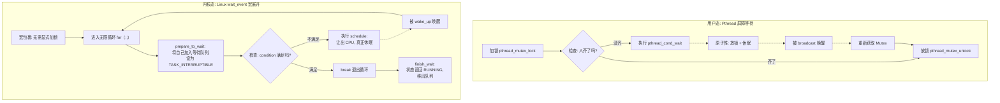
```mermaid
graph TD
    subgraph "用户态: Pthread 屏障等待"
        P1[加锁 pthread_mutex_lock] --> P2{检查: 人齐了吗?}
        P2 -- 没齐 --> P3[执行 pthread_cond_wait]
        P3 -.-> P3_1[原子性: 放锁 + 休眠]
        P3_1 -.-> P3_2[被 broadcast 唤醒]
        P3_2 -.-> P3_3[重新获取 Mutex]
        P3_3 --> P4[放锁 pthread_mutex_unlock]
        P2 -- 齐了 --> P4
    end

    subgraph "内核态: Linux wait_event 宏展开"
        K1[宏包裹: 无需显式加锁] --> K_Loop[进入无限循环 for（;;）]
        K_Loop --> K2[prepare_to_wait: <br/>将自己加入等待队列,<br/>设为 TASK_INTERRUPTIBLE]
        K2 --> K3{检查: condition 满足吗?}
        K3 -- 不满足 --> K4[执行 schedule: <br/>让出 CPU, 真正休眠]
        K4 -.-> K4_1[被 wake_up 唤醒]
        K4_1 --> K_Loop
        K3 -- 满足 --> K5[break 退出循环]
        K5 --> K6[finish_wait: <br/>状态设回 RUNNING,<br/>移出队列]
    end
```

逻辑骨架完全相同：**检查条件 → 不满足则挂起休眠 → 别人修改数据后广播唤醒 → 醒来再次检查**。差异在于：用户态靠 Mutex 原子释放防并发；Linux 内核直接修改任务状态（`TASK_INTERRUPTIBLE`）并调用 `schedule()`。

---

# Lab 5 — Lazy Allocation：惰性分配与 Page Fault

核心任务：修改 `sbrk` 只记账不分配，在 Page Fault 时动态补救。

## 1. Page Fault 三分法

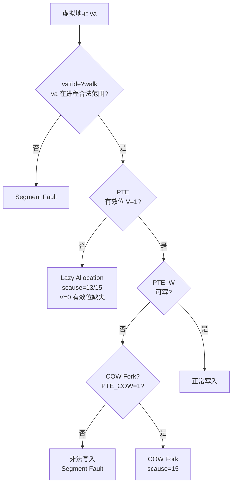
```mermaid
flowchart TD
    A[虚拟地址 va] --> B{vstride?walk<br/>va 在进程合法范围?}

    B -- 否 --> Crash[Segment Fault]

    B -- 是 --> C{PTE<br/>有效位 V=1?}

    C -- 否 --> D[Lazy Allocation<br/>scause=13/15<br/>V=0 有效位缺失]

    C -- 是 --> E{PTE_W<br/>可写?}

    E -- 否 --> F{COW Fork?<br/>PTE_COW=1?}
    F -- 否 --> Crash2[非法写入<br/>Segment Fault]
    F -- 是 --> G[COW Fork<br/>scause=15]

    E -- 是 --> H[正常写入]
```

**scause 编码**：13 = Load Page Fault（读），14 = Instruction Page Fault（取指），15 = Store/AMO Page Fault（写）。

## 2. 承诺-延迟-补救模式

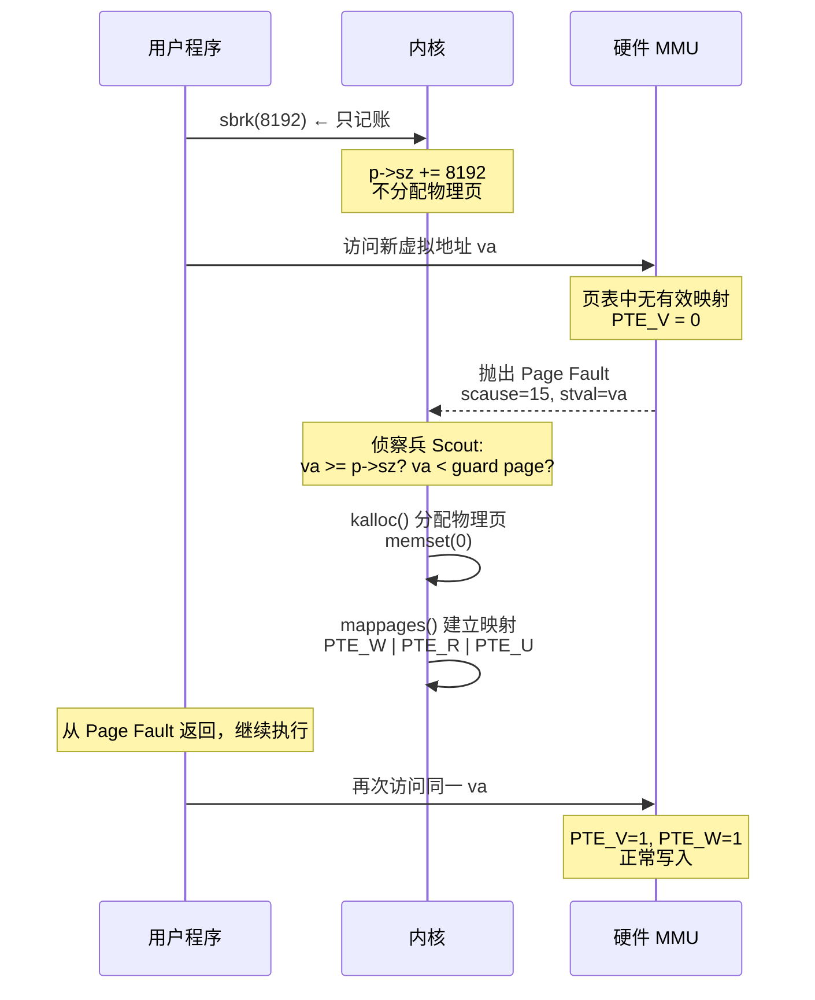
```mermaid
sequenceDiagram
    participant App as 用户程序
    participant Kernel as 内核
    participant MMU as 硬件 MMU

    App->>Kernel: sbrk(8192) ← 只记账
    Note over Kernel: p->sz += 8192<br/>不分配物理页

    App->>MMU: 访问新虚拟地址 va
    Note over MMU: 页表中无有效映射<br/>PTE_V = 0

    MMU-->>Kernel: 抛出 Page Fault<br/>scause=15, stval=va
    Note over Kernel: 侦察兵 Scout:<br/>va >= p->sz? va < guard page?
    Kernel->>Kernel: kalloc() 分配物理页<br/>memset(0)
    Kernel->>Kernel: mappages() 建立映射<br/>PTE_W | PTE_R | PTE_U

    Note over App: 从 Page Fault 返回，继续执行
    App->>MMU: 再次访问同一 va
    Note over MMU: PTE_V=1, PTE_W=1<br/>正常写入
```

## 3. 三个必须容忍"空洞"的函数

- **`uvmunmap`**：进程退出时跳过未映射的 Lazy 页（因从未被访问过）
- **`uvmcopy`**：`fork` 时跳过父进程尚未分配的 Lazy 页
- **`walkaddr`**：系统调用访问 Lazy 地址时主动填补——这是**软件查表 vs 硬件 MMU 的根本区别**：硬件缺页走中断，软件查表走 `walkaddr` 手动填补

## 4. 内核直接映射的"鸡与蛋"悖论

xv6 内核在 `walk()` 中查页表时也需要虚拟地址。解法：**identity translation（恒等映射）**——页表页本身通过高地址（`KERNBASE` 以上）恒等映射，使得"用来查表的页表页"能被同一套页表访问。

---

# Lab 6 — Page Tables：虚拟内存深层应用

核心任务：理解 Sv39 三级页表，实现 `vmprint` 和进程私有内核页表。

## 1. Sv39 虚拟地址拆分

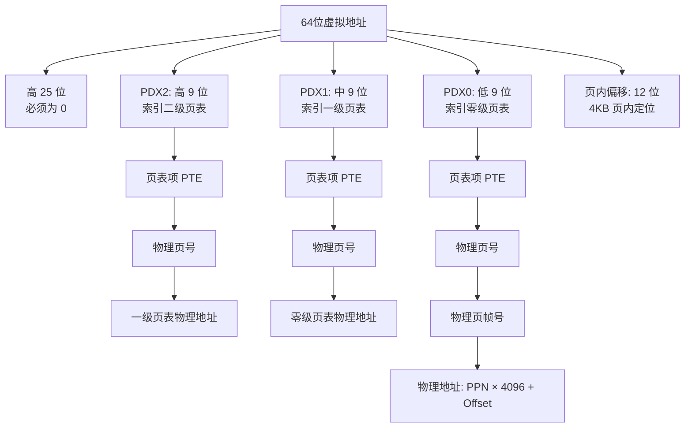
```mermaid
graph TD
    VA[64位虚拟地址] --> Unused[高 25 位<br/>必须为 0]
    VA --> L2[PDX2: 高 9 位<br/>索引二级页表]
    VA --> L1[PDX1: 中 9 位<br/>索引一级页表]
    VA --> L0[PDX0: 低 9 位<br/>索引零级页表]
    VA --> Offset[页内偏移: 12 位<br/>4KB 页内定位]

    L2 --> PTE2[页表项 PTE]
    PTE2 --> PPN2[物理页号]
    L1 --> PTE1[页表项 PTE]
    PTE1 --> PPN1[物理页号]
    L0 --> PTE0[页表项 PTE]
    PTE0 --> PPN0[物理页号]

    PPN2 --> PT1[一级页表物理地址]
    PPN1 --> PT0[零级页表物理地址]
    PPN0 --> PFN[物理页帧号]

    PFN --> PA[物理地址: PPN × 4096 + Offset]
```

## 2. Per-process Kernel Page Table

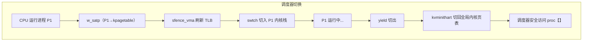
```mermaid
graph TD
    subgraph 调度器切换
        S1[CPU 运行进程 P1] --> S2[w_satp（P1→kpagetable）]
        S2 --> S3[sfence_vma 刷新 TLB]
        S3 --> S4[swtch 切入 P1 内核栈]
        S4 --> S5[P1 运行中...]
        S5 --> S6[yield 切出]
        S6 --> S7[kvminithart 切回全局内核页表]
        S7 --> S8[调度器安全访问 proc【】]
    end
```

**关键约束**：`swtch` 返回后必须**先切回全局内核页表**，再访问 `proc[]` 等调度器数据结构——否则用进程的 `kpagetable` 查不到调度器代码。

## 3. copyin_new 的代价（Meltdown 防护的权衡）

```mermaid
sequenceDiagram
    participant K as 内核
    participant PT as 用户页表
    participant MMU as 硬件 MMU

    rect rgb(240, 240, 240)
    Note over K, MMU: copyout 旧版: 软件查表
    K->>K: walk(addr) 逐级遍历
    K->>K: 从 PTE 提取物理地址
    K->>K: memcpy to 物理地址
    Note over K: 每字节都需软件查表，缓慢
    end

    rect rgb(240, 255, 240)
    Note over K, MMU: copyin_new 新版: shadow mapping
    K->>PT: 将用户页表映射同步到内核页表
    K->>MMU: 直接写入用户 va（硬件 MMU 翻译）
    Note over K: 放弃 Meltdown 攻击隔离<br/>本质: 以安全换性能
    end
```

---

# Lab 7 — Locks：多核性能优化

核心任务：将 `kmem` 全局锁细分为 per-CPU 锁，将 `bcache` 全局锁细分为哈希桶锁。

## Part 1：Per-CPU 内存分配器

### 架构对比

```mermaid
graph TD
    subgraph 旧版架构: 共享单窗口
        CPU0((CPU 0)) --> Lock[kmem.lock]
        CPU1((CPU 1)) --> Lock
        CPU2((CPU 2)) --> Lock
        Lock --> FL[全局 freelist]
    end

    subgraph 新版架构: Per-CPU 专属窗口与窃取
        C0((CPU 0)) --> L0[kmem 0 lock]
        C1((CPU 1)) --> L1[kmem 1 lock]
        C2((CPU 2)) --> L2[kmem 2 lock]

        L0 --> F0[freelist 0]
        L1 --> F1[freelist 1]
        L2 --> F2[freelist 2]

        C1 -.->|1. 自身耗尽| L1
        C1 -.->|2. 释放自身锁<br/>防死锁| L1
        C1 -.->|3. 跨越窃取| L0
    end
```

### AB-BA 死锁陷阱与破局法则

**设计**：CPU1 拿自己的锁去要 CPU2 的锁；CPU2 拿自己的锁去要 CPU1 的锁。**死锁崩溃。**

**破局法则**：在请求别人的资源前，**先放下自己的武器（释放当前锁）**。只要所有 CPU 在任何时刻只持有一把锁，循环等待的死锁条件被彻底打破。

### 内存管理经验

- **freerange 的真相**：硬件的空闲与软件的管理是两码事。`kfree` 将无主的 4KB 内存首尾相连，织成 `freelist` 链表。`memset` 填充垃圾值，防范悬垂指针（Dangling pointers）。
- **零字节开销构建链表**：空闲的物理页本身就是 `struct run`。直接用前 8 字节当 `next` 指针，暴力美学。

---

## Part 2：Buffer Cache — Hash Bucket 与驱逐逻辑

### 架构演进对比

```mermaid
graph TD
    subgraph 旧版设计: 拥堵的单行道
        CPU_A((CPU A)) --> BCacheLock[全局 bcache.lock]
        CPU_B((CPU B)) --> BCacheLock
        CPU_C((CPU C)) --> BCacheLock
        BCacheLock --> GlobalList[(全局双向链表 NBUF=30)]
    end

    subgraph 新版设计: 哈希分流的高速公路
        CPU_1((CPU 1)) -->|Hash 块号| H((Hash Function<br/>% 13))
        CPU_2((CPU 2)) -->|Hash 块号| H

        H -->|匹配到 桶0| L0[桶锁 0]
        H -->|匹配到 桶1| L1[桶锁 1]
        H -->|匹配到 桶12| L12[桶锁 12]

        L0 --> Bucket0[(桶 0 链表)]
        L1 --> Bucket1[(桶 1 链表)]
        L12 --> Bucket12[(桶 12 链表)]
    end
```

### 缓存哲学：从"空间 LRU"到"时间 LRU"

旧版 xv6 用链表的**物理位置**记录 LRU（最近用过的放头部，最久没用的在尾部），导致每次 `brelse` 都要挪动链表节点。

**新版破局**：引入 `lastuse = ticks` 时间戳。在 `brelse` 时，只要用一把小小的**桶锁**记录下归还的时间即可，极其完美地将锁粒度降到最低。

### 驱逐路径的极限拉扯（最硬核部分）

```mermaid
graph TD
    Start((bget: 桶内未命中)) --> DropH1[1.释放当前桶锁<br/>目的: 切断循环等待,防死锁]
    DropH1 --> GetE[2.获取 eviction_lock<br/>目的: 全局序列化驱逐操作]
    GetE --> GetH2[3.重新获取当前桶锁]

    GetH2 --> DCheck{4.Double-Check!<br/>块被别人加载进来了吗?}
    DCheck -- "Yes (虚惊一场)" --> Return[命中, 释放锁并返回]
    DCheck -- "No (真没命中)" --> DropH2[5.再次释放当前桶锁<br/>准备去其他桶偷窃]

    DropH2 --> Search[6.遍历所有桶 0~12 寻找 LRU]

    subgraph 锁的击鼓传花与指针魔术
        Search --> LockI[获取当前遍历桶 i 的锁]
        LockI --> Find{发现更古老的块?}
        Find -- Yes --> Update[记录 before_least 前驱指针<br/>锁定新桶 holding_bucket]
        Update --> DropOld[释放旧的 holding_bucket 锁]
        Find -- No --> DropI[释放当前桶 i 的锁]
    end

    DropI -.-> Search
    DropOld -.-> Search

    Search --> |遍历结束| Relocate[7.摘除受害者节点<br/>修改标签挂入新桶]
    Relocate --> Done((完成返回))
```

### 三大大师级技巧

**技巧 1：Double-Check（双重检查）与防止"幽灵复制"**

持有 `eviction_lock` 后重新锁住自己的桶再查一遍——因为在释放桶锁去抢驱逐锁的短短几微秒空隙里，别人可能已经把饭做好了。这与 Java 并发编程中著名的单例模式 `Double-Checked Locking` 异曲同工！

**技巧 2："击鼓传花"加锁法**

最多同时拿两把锁：`bufmap_locks[holding_bucket]`（保护历史最老块的"封条"）+ `bufmap_locks[i]`（当前正在检查的桶）。一旦在桶 `i` 发现更老的，就释放旧的封条，转移到桶 `i`。**永远不会发生同时锁定多个无关桶造成的网状死锁。**

**技巧 3：单向链表 O(1) 删除魔术（`before_least`）**

不记录最老的块本身，而是**记录最老块的前一个节点 `before_least = b`**。驱逐时，极其优雅的一行代码：`before_least->next = before_least->next->next`，O(1) 复杂度断链操作！

---

# Lab 8 — Copy-on-Write Fork：写时复制优化

核心任务：`fork` 时不拷贝物理页，改为共享 + 设置 PTE_COW，在 Page Fault 时真正拷贝。

## Part 1：核心理念与架构解密

### 为什么需要 COW？

传统 `fork()` 的"深拷贝"策略：无论父进程多大，子进程都要完整复制一份物理内存。尤其在子进程立刻执行 `exec()` 清空内存时，之前的拷贝纯属"竹篮打水一场空"。

### uvmcopy 核心重构（"浅拷贝"策略）

1. **清除写权限**：不仅要清除子进程的 `PTE_W`，**更清除父进程的 `PTE_W`**。确保双方任何一方试图写入时都触发硬件异常。
2. **打上标签**：为 PTE 加上 `PTE_COW` 标志（利用 RISC-V 架构保留的 RSW 位：第 8 位）。
3. **增加引用**：通知物理内存管理器，该页面引用计数 `+1`。
4. **安全过滤**：如果页面原本就是只读（如 `.text` 代码段），则不打 `PTE_COW` 标签，直接共享，防止非法提权。

### Fork 前后的页表状态对比

```mermaid
graph TD
    subgraph "传统 Fork (深拷贝)"
        direction LR
        P_VA1[父进程 虚拟页 A<br/>PTE_W=1] --> PA_1[(物理页 1)]
        C_VA1[子进程 虚拟页 A<br/>PTE_W=1] --> PA_2[(物理页 2 - 新分配)]
    end

    subgraph "COW Fork (浅拷贝 + 权限收紧)"
        direction LR
        P_VA2[父进程 虚拟页 A<br/>PTE_W=0, PTE_COW=1] --> PA_3[(物理页 1 <br/> Ref Count = 2)]
        C_VA2[子进程 虚拟页 A<br/>PTE_W=0, PTE_COW=1] --> PA_3
    end
```

---

## Part 2：中断接管与内核态越过硬件的陷阱

### usertrap 精准拦截

- 通过 `r_scause() == 15` 准确定位 **Store/AMO Page Fault**。
- 通过 `r_stval()` 获取引发错误的精确虚拟地址。
- 三重校验：① 地址在合法进程空间内（`< p->sz`）；② 页表项有效（`PTE_V`）；③ 确实打过标签（`PTE_COW`）。
- "偷梁换柱"：获取新物理页 → 拷贝旧数据 → 清除原映射 → 映射新页并**恢复 `PTE_W`，清除 `PTE_COW`**。

### 内核态的"特权盲区"与 copyout 陷阱（最硬核盲区）

```mermaid
sequenceDiagram
    participant UP as 用户进程 (User Process)
    participant MMU as 硬件 MMU (Hardware)
    participant Trap as usertrap (内核中断处理)
    participant Syscall as read系统调用 (内核态)
    participant CopyOut as copyout (内核查表函数)
    participant COW as COW 复制逻辑

    Note over UP, COW: 路径一：用户态直接写内存 (触发硬件中断)
    UP->>MMU: 执行 store 指令写 COW 虚拟页
    MMU-->>Trap: 检查到 PTE_W=0, 抛出 scause=15
    Trap->>COW: 调用 kama_uvmcheckcowpage 校验
    COW-->>Trap: 校验通过，执行 kama_uvmcowcopy 分配新页
    Trap-->>UP: 恢复执行，重新尝试 store，成功写入新页

    Note over Syscall, COW: 路径二：内核态写入用户空间 (绕过硬件中断)
    UP->>Syscall: 调用 read() 提供 COW 缓冲区的虚地址
    Syscall->>CopyOut: 请求将数据写入该虚地址
    Note right of CopyOut: 致命盲区：<br/>内核通过软件 walk() 查表<br/>不经过 MMU 地址翻译
    CopyOut->>COW: 【补丁代码】手动调用 kama_uvmcheckcowpage
    COW-->>CopyOut: 是 COW 页，手动执行 kama_uvmcowcopy
    CopyOut->>CopyOut: 获取到新物理地址，完成数据写入
    CopyOut-->>Syscall: 返回写入成功
    Syscall-->>UP: 系统调用完成
```

**本质解密**：xv6 内核页表和用户页表完全隔离，内核页表中**没有映射用户的虚拟地址空间**。当 `copyout` 需要向用户地址写数据时，必须调用 `walk()` 进行**纯软件模拟查表**。`walk()` "看"到 `PTE_W=0` 时只返回错误，**不会惊动硬件 MMU 抛出中断**。必须在 `copyout` 内部手动打补丁。

---

## Part 3：物理内存管理、并发控制与死锁规避

### 引用计数"四大金刚"

1. **`kalloc`**：分配新页时引用数 = 1
2. **`kama_krefpage`**：在 `fork`（uvmcopy）时被调用，引用数 +1
3. **`kfree`**：释放页面时引用数 -1，**只有引用数降至 0 时**才真正回收
4. **`kama_kcopy_n_deref`**：触发 COW 时，若引用数 > 1 则分配新页；若引用数 == 1，**极致优化——直接复用当前页，省去高昂分配与拷贝开销**

### 启动期的幽灵 Bug：`kinit` 与 `freerange`

全局数组初始值为 0，直接调用 `kfree` 会让引用数变成 -1。破局：在 `freerange` 调用 `kfree` 前，必须手动 `PA2PGREF(p) = 1`，赋予初始生命。

### 竞态条件与内存泄漏深渊

**案发现场**：父进程 P1 与子进程 P2 共享物理页 P（Ref=2）。P1 触发 COW，读取到 Ref=2 准备分配新页时，发生了时钟中断，CPU 切换到 P2。P2 执行 `exec`，清空页表并调用 `kfree(P)`（Ref→1）。CPU 切回 P1，P1 分配新页并将 P 的 Ref-1（P1 认为只有自己用过）。此时 P1 丢弃了旧页 P，但 P 的 Ref=0，**既不在任何进程页表中，也不在空闲链表里，永远泄漏了！**

**救赎之道**：引入全局自旋锁 `pgreflock`，在"读取计数 → 判断 → 修改计数"的全程加锁，保证原子性。

### 预分配策略（避免死锁）

在 `kama_kcopy_n_deref` 中，**先在锁外** `kalloc` 一个备用页，然后再获取 `pgreflock` 检查状态——持锁时间极短，完美避开 `pgreflock -> kmem.lock` 的嵌套锁风险。

### 物理内存页状态机

```mermaid
stateDiagram-v2
    state "Free" as F
    state "Allocated (Ref=1)" as A
    state "Shared (Ref>=2)" as S

    [*] --> F: 系统初始化/空闲链表

    F --> A: kalloc() 分配

    A --> S: fork() / uvmcopy()
    note right of S: 每次 fork 增加引用

    S --> S: kfree() (某个进程退出, Ref > 1)
    S --> S: usertrap() COW 触发 (其他进程拷贝走)

    S --> A: kfree() (倒数第二个进程退出)
    note left of A: 此时触发 COW 可直接复用！

    A --> F: kfree() (最后一个进程退出)
    note left of F: Ref 减至 0，<br/>挂回 kmem.freelist
```

---

# 五大核心设计模式总结

| 设计模式 | 代表 Labs | 核心思想 |
|---------|---------|---------|
| **承诺-延迟-补救 (Promise-Defer-Fix)** | Lab 5, 8 | 内核先承诺，实际使用时才付出代价。时间换空间。 |
| **引用计数生命周期管理** | Lab 7, 8 | 物理资源的"所有权"通过引用计数表达，freerange 预设为 1 是关键。 |
| **锁粒度细化 (Lock Granularity)** | Lab 7 | 从一把全局锁演化为多把细粒度锁，将竞争分散；有序加锁防死锁。 |
| **双重检查 (Double-Check Pattern)** | Lab 7 | 慢路径锁前后各检查一次，防止并发窗口期的幽灵事件。 |
| **边界守卫 (Boundary Guard)** | Lab 5, 6 | 用户地址空间与硬件外设隔离；Guard Page 防栈溢出覆盖。 |

---

# 知识点地图

```
进程 / 线程
├── fork/exec/wait 语义                    → Lab 1
├── 文件描述符与引用计数 (EOF 真相)         → Lab 1
├── 管道通信与死锁预防                      → Lab 1
├── 上下文切换 (Callee-saved)               → Lab 4
└── 线程同步 (Mutex / CV / Barrier)        → Lab 4

内存管理
├── Sv39 三级页表地址拆分                  → Lab 6
├── 页表数据结构与 walk 遍历               → Lab 6
├── 惰性分配与 Page Fault 处理              → Lab 5
├── 内核直接映射 (identity translation)   → Lab 5
├── Per-process kernel page table          → Lab 6
└── 写时复制 (COW Fork)                    → Lab 8

并发控制
├── 锁的粒度与性能 tradeoff                → Lab 7
├── AB-BA 死锁与有序加锁                   → Lab 7
├── Per-CPU 数据结构                        → Lab 7
├── MESI 缓存一致性协议                     → Lab 4
├── 伪共享 (False Sharing)                 → Lab 4
└── 双检查锁定模式                          → Lab 7

系统调用 / Trap
├── ecall / sret 特权切换                   → Lab 2, 3
├── Trapframe / Context 区别               → Lab 3
├── 中断 / 异常 / 系统调用三分法           → Lab 3
├── 添加系统调用的五步法                   → Lab 2
└── 内核态 vs 用户态查表机制差异            → Lab 5, 8
```

---

# 学习路径建议

| 阶段 | Labs | 核心能力 |
|------|------|----------|
| **入门** | 1–2 | 用户态编程：进程模型、文件描述符、系统调用接口 |
| **进阶** | 3–4 | 内核态入门：Trap 机制、上下文保存、RISC-V 特权级 |
| **内核** | 5–6 | 虚拟内存：惰性分配、Sv39 页表、内核页表切换 |
| **大师** | 7–8 | 并发优化：锁细化、COW 引用计数、多核竞争处理 |
